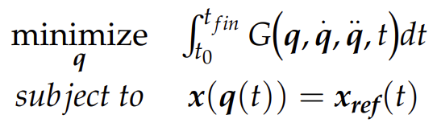
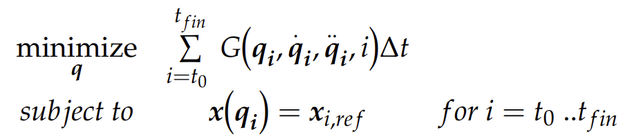
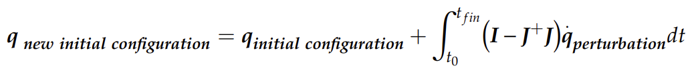
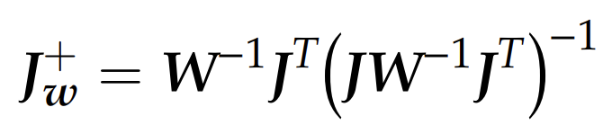
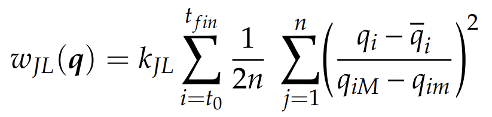

# Dynamics

## Gear Ratos
Motors are fast --> gear ratios to slow them down.

Given reduction of `n:1` (define `q` as the rotational pos of arm):
$$
q_{motor} = nq, \quad \dot{q}_{motor} = n\dot{q}, \quad \ddot{q}_{motor} = n\ddot{q}, \quad \tau_{motor} = \frac{1}{n}\tau
$$

Writing relationship between joint torque and joint acceleration with `1:1` (no reduction):
$$
(I_{motor} + I_{arm})\ddot{q} = \tau_{gravity} + \tau_{motor}
$$

If we now include `n:1` reduction:
$$
(n^2I_{motor} + I_{arm})\ddot{q} = \tau_{gravity} + n\tau_{motor}
$$

Even though inertia of motor is small, gear reduction makes it significant in overall dynamics. "Reflected Inertia" of the motor at the arm is the natural inertia of the motor multiplied by gear ratio squared.

Result: even when arms perform many different tasks w/varying loads, can use the same PID gains (don't use gain scheduling). Motor's own inertia (which is constant regardless of load) ends up dominating the dynamics.

## Torque-controlled Robots
Almost all robot arms are just position feedback. Makes them less "compliant". Reason: generally, current input into motor is proportional to torque output. However, for motors with high gear ratios (which are 99% of robot arms), there is no costant/clear relatioship between current and output torque.

A few ways to accomplish torque-controlled--
1. new type of motors (i.e. MIT Cheetah) that are low RPM/high torque, don't need gearbox
2. Hydraulics are roughly torque-controlled (via pressure)
3. Add torque sensors to joints of arm (still using fast motors and high gear ratios), to feedback control with measured torque

Torque sensors are usually strain gauges (measure deflection in metal) or Series-Elastic Actuators.

## Notation Used

`q` = vector of joint angles

$^Bp^A_C$ = **position** of point A relative to origin B in frame C.

If frame not specified, assume corresponding to origin. If neither frame nor origin specfied, assume world frame/origin ($W$).

Vehicle coordinates:
- +X = forward
- +Y = left
- +Z = up

$P^A$ = position of A relative to World origin.

Use $R$ to denote a rotation:

$^BR^A$ = **rotation** of frame A relative to frame B.

Use $X$ to denote a "pose" (aka "transform" or "RigidTransform"):

$^BX^A$ is the **pose** of frame A measured from frame B.

Just $X$ means pose of body frame of object relative to World origin.

Pose never has a subscript (no need to specify what frame it's expressed in as the pose already describes a reference frame).

### Valid Operations:

Positions can be added when one's target symbol equals the other's reference symbol (and when in the same frame):

$^Ap^B_F + ^Bp^C_F =$ $^Ap^C_F$

Additive inverse:

$^Ap^B_F =$ $-^Bp^A_F$

Switching frames (multiple by rotation matrix):

$^AP^B_G = (^GR^F) ^AP^B_F$

Compounding switching frames is valid when their target and reference symbols match: 

$^AR^B$ $^BR^C =$ $^AR^C$

Rotation Inverse:

$[^AR^B]^{-1} =$ $^BR^A$

Transforms compose:

$^AX^B$ $^BX^C =$ $^AX^C$

Transform Inverse:

$[^AX^B]^{-1} =$ $^BX^A$

Transforms can be applied to positions if target and reference symbols match:

$^Gp^A =$ $^GX^F$ $^Fp^A$

## Rotations
 - Rotation Matrices: orthnormal matrix; columns = x, y, z axes (1st column of the transform $^GR^F$ has x-axis of frame $F$ expressed in $G$)
 - RollPitchYaw: a rotation around z (yaw) after a rotation around y (pitch) after a rotation around x (roll)
 - Axis angles: scalar rotation around 3D vector. Quaternions are basically the same as Axis Angle, but normalized and has unique properties (i.e. doesn't have a singularity when rotation scalar is 0)

## Basic Pick and Place

Define $G_{pick}, G_{pre-pick}, G_{post-pick}, G_{place}, G_{pre-place}, G_{post-place}$, various points.

Define $X^O$ as pose of object to be picked up in world frame. Define $X^{O_d}$ as the desired position to place the object.

Move gripper to $^OX^{G\_pregrasp}$ (a safe position above the object), then to $^OX^{G\_grasp}$, a grasping position relative to the object. Close the gripper. Move the gripper to $X^O = X^{O_d}$. Open the gripper.

## Forward Kinematics

Goal: map joint angles to a transform representing pose of gripper in World frame:

$X^G = f^G_{kin}(q)$

In Drake, `MultibodyPlant` --> all bodies (i.e. segments of arm, the brick) organized in tree; has parent/children, connected by `Joint`. `Joint` are constraints limiting degrees of freedom of each child body.

For each joint: $J_C$ = child frame, $J_P$ = parent frame for a given joint. $^CX^{J_C}$ = transform from child frame to joint frame, $^PX^{J_P}$

Transform from child joint angles to parent:

$^PX^C(q) =$ $^PX^{J_P}$ $^{J_{P}}X^{J_C}(q)^{J_C}X^{C}$

## Differential & Inverse Kinematics

### Jacobian

Defined as:

$$ J(q) dq = \frac{\delta f(q)}{\delta q} dq$$

Where $q$ is the current joint positions of the robot.

Intuitively, we form a matrix of the partial derivatives of the foward kinematic function with respect to each component of $q$. For example, this is the Jacobian for a 2D 2 jointed arm (with 2 $q$ components). $x$ is the forward-kinematic function for the x-coordinate of the gripper, and likewise for $y$:

 

Spatial Velocity vector (6 components):

$$
^AV^B_C = 
\left[ \begin{array}{c}
^A\omega^B_C \\
^Av^B_C \\
\end{array} \right] 
$$

As opposed to generalized velocity, which is simply $\dot{q}$ (and has as many components as $q$ does).

Goal of **"differential kinematics"** is to derive $^AV^B_C$ from `q` (joint positions of arm) using the Jacobian (specifically the "Geometric Jacobian", which maps $\dot{q}$ (joint velocities) to Spatial Velocity). Basically, the Jacobian maps differential changes in joint positions to differential changes in end-effector position, which is why taking the Jacobian is called Differential Kinematics.

Note: The inverse of the Jacobian therefore maps Spatial Velocity to $\dot{q}$, or joint velocities.

General idea: given desired gripper spatial velocity $V^{G_d}$, derive joint velocities using $v = [J^G(q)]^{-1} V^{G_d}$ where $J^G$ is the Jacobian mapping $v$ to $V^{G_d}$.

$V^{G_d}$ (along with the inverse of the Jacobian) is computed at ~1000 Hz to send new joint-velocities to the robot as fast as possible.

Note that the joint velocities can then be integrated to find joint positions to feed to the iiwa controller. In Drake, an extra `Integrator` is added using DiagramBuilder.

The Jacobian is computed by Drake using `CalcJacobianSpatialVelocity`.

#### Notes on the Jacobian:

Jacobian is not invertible; instead, we use pseudo-inverse $[J^G(q)]^+$. Pseudo-inverse very robust; when true inverse exists, returns that. When many solutions exist, returns least squares velocities solution. When no solutions exist, returns closest velocities solution.

Technically, this is what the Pseudo-inverse does: 

$$\min\limits_{v} |J^G(q)v - V^{G_d}|^2$$

$$v^* = [J^G(q)]^+V^{G_d}$$

This is basically an n-dimensional parabola; in most cass, there is a definite answer. If we actually expand the least-squares expression, we get: $v^TJ^tJv - 2v^tJ^tV + V^tV$ ($V$ is a vector). To find the minimum, we set the gradient of this expression to 0, which yields an analytical solution: $(J^TJ)^{-1}J^TV$ (the pseudo-inverse is equal to this expression).

When min. singular value of Jacobian is near 0, inverse returned is least accurate. In these configurations, arm loses a DoF (in real life).

## Adding Constraints to Differential Inverse Kinematics

Problem: Psuedo-inverse --> extremely large velocities around singularities.

#### Velocity Constraints:

If we bound $v$, then we need a different method to solve for $J^G(q)$ in $\min\limits_{v} |J^G(q)v - V^{G_d}|^2$.

Observe that this is a quadratic objective with linear constraints, so we can use Quadratic Programming to solve rather than using pseudo-inverse.

#### Position & Accel Constraints:

Simply add more constraints to the Quadratic Programming problem; this time, bouding $q$ and $\dot{v}$. We also estimate a time step before the next loop iteration, and use $v^*$ to take into account the change in position and velocity from this loop.

These constraints look like this ($h$ is the estimated time step, i.e. the loop time, a fixed value):

$$q_{min} < q + hv^* < q_{max} $$
$$\dot{v}_{min} < \frac{v*-v}{h} < \dot{v}_{max}$$

Force limits can also be applied as a linear constraint, by calculating torque.

Also possible to add a collision avoidance constraint.

## Task Prioritization (Using "Null Space Projections")

When Jacobian is 6x7, has a null space; there are multiple solutions to joint angles to achieve the same end effector spatial velocity. Can place preferences which which joint angle in the null space of the optimization.

Call $P$ an orthonormal basis of $Null(J)$: $P(q) = I-J^+J$

Add a secondary objective like so: 

$$\min\limits_{v} |J^G(q)v - V^{G_d}|^2 + \epsilon P(q)|v-K_p(q^d-q)|^2$$

This prefers joint velocities $v$ that make the arm go near $q^d$ (desired joint position); $K_p(q^d-q)$ is a proportional controller outputting a target velocity to move $q$ to $q^d$, and $P$ maps this to the null space (therefore, using the extra degree of freedom, so this secondary preferece does not interfere with the primary objective (which is to minimize the spatial velocity error)). 

Technically, the null-space is not calculated perfectly, so the secondary preference can impact the primary objective slightly; therefore, $\epsilon=0.1$ is usually used to protect the primary objective.

## Alternative Control Method (A Brief Mention)

Using the least squares optimization above, when arm hits a constraint, might cause arm to deviate from the intended/planned trajectory ($V^{G_d}$ might not be exactly what we wanted). THIS IS BAD; the arm won't go where we want.

To solve this issue, let's scrap all of the pseudo-inverse, least squares stuff explained above. Instead, we can *force* the end-effector to move in the direction of the desired spatial velocity from the start:

$$max(\alpha) \space | \space J^{G}v^* = \alpha V^{G_d}$$

$$ 0 \leq \alpha \leq 1$$

$v^*$ can still be solved using quadratic programming, and we can apply all the same constraints (velocity, position, acceleration, force, collision avoidance, etc.) described above.
 
With this method, if $v^*$ isn't computable within the constraints (i.e. at singularities, where joint velocities can get extremely large), the outputted spatial velocity of the end-effector is still in the direction of the desired spatial velocity, just may be scaled to be slower. If the Jacobian loses row-rank and isn't able to achieve the direction of the desired spatial velocity, $\alpha$ is simply set to 0 so the arm stops moving (for safety).

## Interpolation to Generate Trajectories from Keyframes

Interpolating between 2 target positions: linear interpolation

Interpolating between 2 target rotations: SLERP--spherical linear interp. `piecewiseQuaternionSlerp` in Drake.

For 2 links of arm (1 link has origin M, other link has origin F):

$^{B_1}X^M$ $^MX^F(q)$ $^FX^{B_2}$

# Notes: Tringali, Alessandro, and Silvio Cocuzza. “Globally Optimal Inverse Kinematics Method for a Redundant Robot Manipulator with Linear and Nonlinear Constraints.” Robotics, vol. 9, no. 3, July 2020, p. 61. Crossref, https://doi.org/10.3390/robotics9030061.

### Paper Summary:
- Goal of paper: solve trajectory tracking problem of redundant (i.e. 7 DoF) manipulators
- New optimization method - searches multiple optima; good multi-objective optimization
- Based on multi-start method, generates population of candidate solutions that respect kinematic constraints (i.e. end-effector trajectory is exactly tracked), picks best few as initial guess.

Note that the paper does all their testing on a 3 DoF arm, which is computationally much less expensive.

## Problem Formulation

 

Where:
- $q$ = joint positions as a function of time
- $G$ = cost function
- $x_{ref}$ is the desired trajectory to follow
- $x(q(t))$ performs forward kinematics on $q$

The paper considers 2 cost functions, 1 that minimizes energy, and the other, torque:
$$ G_{kin} = \frac{1}{2} \dot{q}^T M(q) \dot{q} $$

$$ G_{tor} = \tau^T \tau \space \space \space | \space \space \space \tau = M(q) \ddot{q} + n(q, \dot{q}) $$

Where $M(q)$ is the 3D moment of inertia matrix for the manipulator.

Putting the optimization in discreet form:

 

2 classes of initial conditions:
- if we assume robot starts from rest ("free initial conditions"):

$$ x(q(t_0)) = x_{ref}(t_0) $$
$$ \dot{q}(t_0) = 0 $$

- if we assume the robot performs cyclical/repetitive task (i.e. in industrial settings) ("cyclical initial conditions"):

$$ q(t_0) = q(t_{fin}) $$
$$ \dot{q}(t_0) = \dot{q}(t_{fin}) $$

## Method

The general procedure is:
1. Generate candidate solution $i$.
2. Apply local search to improve $i$. Let's call the local optimum found $x$.
3. If $x$ is the best candidate solution so far, save it
4. Repeat 1-3 until a stop criterion is fulfilled.

We go into more detail below.

### 1. Generating Random Initial Configurations $q_0$

We take as input a desired end-effector trajectory $\{x\}$.

First, we generate $n_{start}$ random initial joint configurations $q_0$ that satisfy the initial end-effector position $x_0$ at $t_0$. The $n_{start}$ intial configurations should generally represent the whole space of possible joint configurations ($n_{start}$ was arbitrarily set to 66 in this paper). Usually, the way we generate these starting joint configurations is by starting with a random one, then deriving more using IK. Recall that:

$$\dot{q} = J^+ \dot{x} + (I - J^+ J)\dot{q}_{perterbation}$$

As explained in the main notes above, $(I - J^+ J)$ is the projection into the Null Space, so we're project $\dot{q}_{perterbation}$ into the null space, where $\dot{q}_{perterbation}$ is a secondary objective to have a non-zero joint velocity. Because, in our case, since we're generating new joint configurations for the same end-effector position, $\dot{x}=0$.

Therefore, the way to generate new initial joint configurations is;

 

The paper generates these $n_{start}$ somewhat arbitrarily; they may violate joint limits, they may or may not span the whole space of possible intial configurations, they just assume the later optimization can handle it. Also, I don't really understand what that integral is doing or exactly what $\dot{q}_{perterbation}$ is.

*Note: this paper assumes any initial joint configuration that satisfies the initial end-effector position is fine; however, if your robot is at the desired initial end-effector position already, you can constraint $n_{start} = 1$ and set the initial joint configuration to the current joint positions of the robot. This way, the robot doesn't have to change its initial configurations before beginning to follow the trajectory.*

### 2. Sampling Trajectories

This method involves random sampling, so, firstly, we define $n_{candidates}$ as the number of random samples. We generally pick $n_{candidates} = n_{path points}^2 * n_{joints}^2$ to ensure we get a good optimum.

Next, our goal will be to generate $n_{candidates}$ candidate joint trajectories for each starting joint configuration $q_0$. To do this, we use inverse kinematics but with a weighted pseudo-inverse of Jacobian defined like so:

 

$W$ is a symmetric, Positive Definite matrix, where weights define importance of each joint to the cost.

To generate our candidate solutions, we generate a set of $n_{candidates}$ random weight matrices $W$.  We use all these weight matrices to create $n_{candidates}$ different Jacobians $J^+_w$. For all $J^+_w$, we multiply by $J^+_w v$ to obtain a joint velocity profile for the trajectory. Then, we integrate the joint velocties to get joint position trajectories $\{q_{random}\}$.

We then calculate the cost of each $\{q_{random}\}$ using our cost function $G$ above. We add this extra cost term to penalize exceeding joint limits:

 

which basically sums the distance from every joint position to its respective joint mechanical limits ($q_{iM}$ is the max position, $q_{im}$ is the min position, $\bar{q}_i$ is the middle between max and min, and there are $n$ joints), at every time step over the trajectory. Note that this doesn't prevent exceeding joint limits from being considered; just penalizes them.

### 3. Running the Optimization with Multi-Start

We then pick the best $n_{runs}$ solutions of all the $\{q_{random}\}$ from all $n_{candidates}$ of all initial configurations $q_0$ ($n_{runs}$ is arbitrarily set to 24) to launch the Multi-Start Optimization. This just means we run the optimization described above (to minimize $G$; we can ignored the added cost $w_{JL}(q)$ for being near joint limits now) 24 times and use these 24 trajectories as initial guesses. During this optimization, we also ensure joint limits are strictly enforced by adding simple bounding box constraints to $q$ during the optimization.

Finally, we pick the best result of the Multi-Start Optimization as our final trajectory.

### An Aside: An Alternative to the Optimization

Basically, optimization may be computationally heavy for high DoF arms or long paths. So, the strategy is to optimize on a smaller subset of the path, then "interpolate" to get the full path.

1. A subset of the end-effector trajectory $\{x\}$ is chosen using a sampling interval $\Delta t_{interp} = n*\Delta t$, call it $\{x_1\}$, starting from $x_0$.

2. Optimize $\{q\}$ for $\{x_1\}$ using the methods above (sampling random initial configurations, generating trajectories using random $W$, running multi-start optimization).

3. Select a new $\Delta t_{interp \space new} < \Delta t_{interp}$ and select a new subset of the trajectory using this new time interval (so includes more trajectory points than last time), call this new subset $\{x_2\}$. 

4. Use cubic splines to interpolate the values of $q$ for the trajectory points that are present in $\{x_2\}$ but not in $\{x_1\}$. Now, we have a subset of $\{q\}$ that should be near optimal (if the spline interpolations are good) but faster to compute.

5. Optimize the subset of $\{q\}$ using the subset interpolated in 4 as initial guess.

6. Repeat 3-5 until $\Delta t_{interp \space new} = \Delta t$.

This should be fast, because the initial optimization in step 2 (which is only done once) is done on much fewer parameters, then, we use interpolation to generate good initial guesses as we do optimizations with progressively more and more parameters (and these good guesses should make these later optimizations faster). 

Note that this is what the authors of the paper actually used in their testing.

## Appendix: Lagrange Multipliers Method of Optimization

To solve a constrained optimization with Lagrange Multipliers, all constraints must be of the form $g(x, y, ...) = k$, or, in other words, some function of the decision variables is equal to a constant.

Say our cost function is $f(x, y, ...)$. Our goal is to minimize the cost function.

What we do is sum the cost function and each constraint function times a lagrange multiplier; for example:

$$ L = f(x, y, ...) + \lambda_1 * g_1(x, y, ...) + \lambda_2 * g_2(x, y, ...) $$

Then, we set the gradient of the Lagrangian $L$ equal to 0. This (in addition to the constraint quations themselves) create a system of equations, and we can solve this system for the decision variables using a symbolic algebra solver. We may come out with multiple solutions; each solution is a local min or max, so we just need to check all the solutions to find the global min.

The mathematical reason for why this works is that we're finding all the positions where the gradients of the cost function and the constraints are parallel; in other words, the gradient of the cost is equal to a constaint $\lambda$ times the gradient of the constraint. These are the points that local min/max occur.

Good Visuals: https://www.youtube.com/watch?v=GR4ff0dTLTw&t=490s&pp=ygUbbGFncmFuZ2UgbXVsdGlwbGllcnMgbWF0bGFi

Good Explanations for the Math (12:30 shows helpful equations): https://www.youtube.com/watch?v=5A39Ht9Wcu0

# QUESTIONS FOR TEDRAKE
- Confused abt forward kinematics--who owns the kinematic frames at each joint? Is it the joint itself? Or segmnts of the arm?
