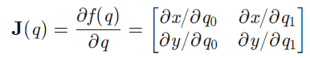

# 6.4210 Notes

# Dynamics

## Gear Ratos
Motors are fast --> gear ratios to slow them down.

Given reduction of `n:1` (define `q` as the rotational pos of arm):
$$
q_{motor} = nq, \quad \dot{q}_{motor} = n\dot{q}, \quad \ddot{q}_{motor} = n\ddot{q}, \quad \tau_{motor} = \frac{1}{n}\tau
$$

Writing relationship between joint torque and joint acceleration with `1:1` (no reduction):
$$
(I_{motor} + I_{arm})\ddot{q} = \tau_{gravity} + \tau_{motor}
$$

If we now include `n:1` reduction:
$$
(n^2I_{motor} + I_{arm})\ddot{q} = \tau_{gravity} + n\tau_{motor}
$$

Even though inertia of motor is small, gear reduction makes it significant in overall dynamics. "Reflected Inertia" of the motor at the arm is the natural inertia of the motor multiplied by gear ratio squared.

Result: even when arms perform many different tasks w/varying loads, can use the same PID gains (don't use gain scheduling). Motor's own inertia (which is constant regardless of load) ends up dominating the dynamics.

## Torque-controlled Robots
Almost all robot arms are just position feedback. Makes them less "compliant". Reason: generally, current input into motor is proportional to torque output. However, for motors with high gear ratios (which are 99% of robot arms), there is no costant/clear relatioship between current and output torque.

A few ways to accomplish torque-controlled--
1. new type of motors (i.e. MIT Cheetah) that are low RPM/high torque, don't need gearbox
2. Hydraulics are roughly torque-controlled (via pressure)
3. Add torque sensors to joints of arm (still using fast motors and high gear ratios), to feedback control with measured torque

Torque sensors are usually strain gauges (measure deflection in metal) or Series-Elastic Actuators.

## Notation Used

`q` = vector of joint angles

$^Bp^A_C$ = **position** of point A relative to origin B in frame C.

If frame not specified, assume corresponding to origin. If neither frame nor origin specfied, assume world frame/origin ($W$).

Vehicle coordinates:
- +X = forward
- +Y = left
- +Z = up

$P^A$ = position of A relative to World origin.

Use $R$ to denote a rotation:

$^BR^A$ = **rotation** of frame A relative to frame B.

Use $X$ to denote a "pose" (aka "transform" or "RigidTransform"):

$^BX^A$ is the **pose** of frame A measured from frame B.

Just $X$ means pose of body frame of object relative to World origin.

Pose never has a subscript (no need to specify what frame it's expressed in as the pose already describes a reference frame).

### Valid Operations:

Positions can be added when one's target symbol equals the other's reference symbol (and when in the same frame):

$^Ap^B_F + ^Bp^C_F =$ $^Ap^C_F$

Additive inverse:

$^Ap^B_F =$ $-^Bp^A_F$

Switching frames (multiple by rotation matrix):

$^AP^B_G = (^GR^F) ^AP^B_F$

Compounding switching frames is valid when their target and reference symbols match: 

$^AR^B$ $^BR^C =$ $^AR^C$

Rotation Inverse:

$[^AR^B]^{-1} =$ $^BR^A$

Transforms compose:

$^AX^B$ $^BX^C =$ $^AX^C$

Transform Inverse:

$[^AX^B]^{-1} =$ $^BXs^A$

Transforms can be applied to positions if target and reference symbols match:

$^Gp^A =$ $^GX^F$ $^Fp^A$

## Basic Pick and Place

Define $G_{pick}, G_{pre-pick}, G_{post-pick}, G_{place}, G_{pre-place}, G_{post-place}$, various points.

Define $X^O$ as pose of object to be picked up in world frame. Define $X^{O_d}$ as the desired position to place the object.

Move gripper to $^OX^{G\_pregrasp}$ (a safe position above the object), then to $^OX^{G\_grasp}$, a grasping position relative to the object. Close the gripper. Move the gripper to $X^O = X^{O_d}$. Open the gripper.

## Forward Kinematics

Goal: map joint angles to a transform representing pose of gripper in World frame:

$X^G = f^G_{kin}(q)$

In Drake, `MultibodyPlant` --> all bodies (i.e. segments of arm, the brick) organized in tree; has parent/children, connected by `Joint`. `Joint` are constraints limiting degrees of freedom of each child body.

For each joint: $J_C$ = child frame, $J_P$ = parent frame for a given joint. $^CX^{J_C}$ = transform from child frame to joint frame, $^PX^{J_P}$

Transform from child joint angles to parent:

$^PX^C(q) =$ $^PX^{J_P}$ $^{J_{P}}X^{J_C}(q)^{J_C}X^{C}$

## Differential & Inverse Kinematics

### Jacobian

Defined as:

$$ J(q) dq = \frac{\delta f(q)}{\delta q} dq$$

Where $q$ is the current joint positions of the robot.

Intuitively, we form a matrix of the partial derivatives of the foward kinematic function with respect to each component of $q$. For example, this is the Jacobian for a 2D 2 jointed arm (with 2 $q$ components). $x$ is the forward-kinematic function for the x-coordinate of the gripper, and likewise for $y$:

 

Spatial Velocity vector (6 components):

$$
^AV^B_C = 
\left[ \begin{array}{c}
^A\omega^B_C \\
^Av^B_C \\
\end{array} \right] 
$$

As opposed to generalized velocity, which is simply $\dot{q}$ (and has as many components as $q$ does).

Goal of **"differential kinematics"** is to derive $^AV^B_C$ from `q` (joint positions of arm) using the Jacobian (specifically the "Geometric Jacobian", which maps $\dot{q}$ (joint velocities) to Spatial Velocity). Basically, the Jacobian maps differential changes in joint positions to differential changes in end-effector position, which is why taking the Jacobian is called Differential Kinematics.

Note: The inverse of the Jacobian therefore maps Spatial Velocity to $\dot{q}$, or joint velocities.

General idea: given desired gripper spatial velocity $V^{G_d}$, derive joint velocities using $v = [J^G(q)]^{-1} V^{G_d}$ where $J^G$ is the Jacobian mapping $v$ to $V^{G_d}$.

$V^{G_d}$ (along with the inverse of the Jacobian) is computed at ~1000 Hz to send new joint-velocities to the robot as fast as possible.

Note that the joint velocities can then be integrated to find joint positions to feed to the iiwa controller. In Drake, an extra `Integrator` is added using DiagramBuilder.

The Jacobian is computed by Drake using `CalcJacobianSpatialVelocity`.

#### Notes on the Jacobian:

Jacobian is not invertible; instead, we use pseudo-inverse $[J^G(q)]^+$. Pseudo-inverse very robust; when true inverse exists, returns that. When many solutions exist, returns least squares velocities solution. When no solutions exist, returns closest velocities solution.

Technically, this is what the Pseudo-inverse does: 

$$\min\limits_{v} |J^G(q)v - V^{G_d}|^2$$

$$v^* = [J^G(q)]^+V^{G_d}$$

This is basically an n-dimensional parabola; in most cass, there is a definite answer. If we actually expand the least-squares expression, we get: $v^TJ^tJv - 2v^tJ^tV + V^tV$ ($V$ is a vector). To find the minimum, we set the gradient of this expression to 0, which yields an analytical solution: $(J^TJ)^{-1}J^TV$ (the pseudo-inverse is equal to this expression).

When min. singular value of Jacobian is near 0, inverse returned is least accurate. In these configurations, arm loses a DoF (in real life).

## Adding Constraints to Differential Inverse Kinematics

Problem: Psuedo-inverse --> extremely large velocities around singularities.

#### Velocity Constraints:

If we bound $v$, then we need a different method to solve for $J^G(q)$ in $\min\limits_{v} |J^G(q)v - V^{G_d}|^2$.

Observe that this is a quadratic objective with linear constraints, so we can use Quadratic Programming to solve rather than using pseudo-inverse.

#### Position & Accel Constraints:

Simply add more constraints to the Quadratic Programming problem; this time, bouding $q$ and $\dot{v}$. We also estimate a time step before the next loop iteration, and use $v^*$ to take into account the change in position and velocity from this loop.

These constraints look like this ($h$ is the estimated time step, i.e. the loop time, a fixed value):

$$q_{min} < q + hv^* < q_{max} $$
$$\dot{v}_{min} < \frac{v*-v}{h} < \dot{v}_{max}$$

Force limits can also be applied as a linear constraint, by calculating torque.

Also possible to add a collision avoidance constraint.

## Task Prioritization (Using "Null Space Projections")

When Jacobian is 6x7, has a null space; there are multiple solutions to joint angles to achieve the same end effector spatial velocity. Can place preferences which which joint angle in the null space of the optimization.

Call $P$ an orthonormal basis of $Null(J)$: $P(q) = I-J^+J$

Add a secondary objective like so: 

$$\min\limits_{v} |J^G(q)v - V^{G_d}|^2 + \epsilon P(q)|v-K_p(q^d-q)|^2$$

This prefers joint velocities $v$ that are near $K_p(q^d-q)$; $K_p(q^d-q)$ is a proportional controller outputting a target velocity to move $q$ to $q^d$, and $P$ maps this to the null space (therefore, using the extra degree of freedom, so this secondary preferece does not interfere with the primary objective (which is to minimize the spatial velocity error)). 

Technically, the null-space is not calculated perfectly, so the secondary preference can impact the primary objective slightly; therefore, $\epsilon=0.1$ is usually used to protect the primary objective.

## Alternative Control Method (A Brief Mention)

Using the least squares optimization above, when arm hits a constraint, might cause arm to deviate from the intended/planned trajectory ($V^{G_d}$ might not be exactly what we wanted). THIS IS BAD; the arm won't go where we want.

To solve this issue, let's scrap all of the pseudo-inverse, least squares stuff explained above. Instead, we can *force* the end-effector to move in the direciton of the desired spatial velocity from the start:

$$max(\alpha) \space | \space J^{G}v^* = \alpha V^{G_d}$$

$$ 0 \leq \alpha \leq 1$$

$v^*$ can still be solved using quadratic programming, and we can apply all the same constraints (velocity, position, acceleration, force, collision avoidance, etc.) described above.
 
With this method, if $v^*$ isn't computable within the constraints (i.e. at singularities, where joint velocities can get extremely large), the outputted spatial velocity of the end-effector is still in the direction of the desired spatial velocity, just may be scaled to be slower. If the Jacobian loses row-rank and isn't able to achieve the direction of the desired spatial velocity, $\alpha$ is simply set to 0 so the arm stops moving (for safety).

## Interpolation to Generate Trajectories from Keyframes

Interpolating between 2 target positions: linear interpolation

Interpolating between 2 target rotations: SLERP--spherical linear interp. `piecewiseQuaternionSlerp` in Drake.

For 2 links of arm (1 link has origin M, other link has origin F):

$^{B_1}X^M$ $^MX^F(q)$ $^FX^{B_2}$

# QUESTIONS FOR TEDRAKE
- Confused abt forward kinematics--who owns the kinematic frames at each joint? Is it the joint itself? Or segmnts of the arm?
