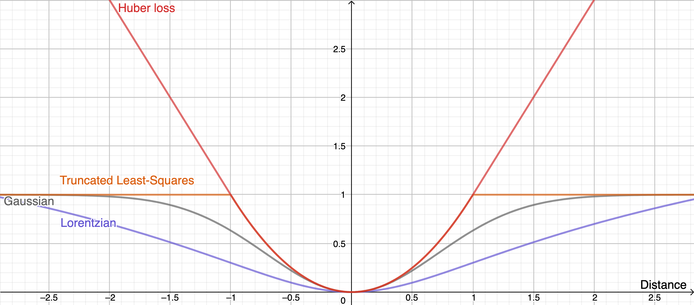

# 6.4210 Notes

# Perception

# Part 1: Traditional Geometric Perception

### Sensors
- Lidar (Veladyne) - 360 degree laser ToF
- Stereo Cameras (2x RGB, calculate distance)
- Structured Light (projecting patterns) (Microsoft Kinect)
- Projected Texture Stereo (Intel Realsense)
   - projects IR pattern on wall
- Monocular Depth (single camera depth estimation using Deep Learning)

### 3D Representations
- RGB-D (RGB + depth at each pixel)
- Point Cloud (list of 3D points, possibly with color value)
- Triangle Mesh
- Signed Distance Functions (Neural Radiance Fields)
- Voxels / Occupancy Grids

## Point Cloud Registration (aka Scan Matching)

Goal: Given 2 point clouds (PC), find rigid transformation that optimal aligns them. Practically, we may have a point cloud in the wild when we look for objects, and a ground truth point cloud for that same object already known.

#### Some Notation:
- Points in the ground truth point cloud (or "model") $m_i$.
- Points in the detected object/scene (from depth sensor), transformed into camera coordinates $^CX^{s_i}$: $s_i$.
- Number of points in model: $N_m$.
- Number of points in scene: $N_s$.
- transform for camera position in world (assume this is known, either as a fixed pose in the world or, if it is mounted on the robot, using forward kinmaticss): $X^C$
- centroid of model PC: $\bar{m}$ (equal to average of all points in PC)
- centroid of scene PC: $\bar{s}$

Note: for the below, we will make the major assumption of "known correspondences": each point in scene PC corresponds to point in model PC.Corrspondence vector: $c \in [1,n_m]^{N_s}$, where $c_i = j$ denotes that $s_i$ corresponds wth $m_j$. Correspondence is *one-to-one*, but not *onto* (each scene point maps to a model point).

### Solving Point Cloud Registration ###

Basically, the goal is to solve for a $^W X^O$ such that $^W X^O$ transforms the model points into the scene points in world frame:

$^Wp^{m_{c_i}} =$ $^WX^O$ $^Op^{m_{c_i}} =$ $^WX^C$ $^Cp^{s_i}$

Note: it technically is possible to solve for $^W X^O$ algebraically (taking inverse and left-multiplying both sides of the equation by it), but again, noise => not always invertible.

Note: we define $O$ as object frame; the coordinate frame that the model is defined in (i.e. the model has its own origin).

Instead, to solve for $^W X^O$, we create an optimization problem. We find the transformation on the model PC that minimizes difference between each corresponding point in the model PC and scene PC:

$$\min\limits_{X} \sum^{N_s}_{i=1} || X^O \space ^Op^{m_{c_i}} - X^C \space {^C}p^{s_i}||^2$$

Re-writing the transformation $X^O$ as a rotation matrix and a displacement (so the goal of the optimization becomes to solve for $R$ and $p$):

$$\min\limits_{X} \sum^{N_s}_{i=1} ||p + R \space ^Op^{m_{c_i}} - X^C \space {^C}p^{s_i}||^2$$

Note: Technically, $R$ should be $R^O$ and $p$ should be $p^O$, since they rotate/translate from object frame to world frame, but they're left off for convenience.

$$ where \space R^T = R^{-1}, \space det(R) = 1$$

Note: can also be written as (by applying the $X^C$ transform to the scene points):

$$\min\limits_{X} \sum^{N_s}_{i=1} ||p + R \space ^Op^{m_{c_i}} - p^{s_i}||^2$$

First, we compute $\bar{s}$ and $\bar{m}$, the centroids of the model and scene. We can quickly solve for $p$ as the difference between these centroids. 

In solving for $R$, we can see that this optimization problem is quadratic ($p + R \space ^Op^{m_{c_i}} - X^C \space {^C}p^{s+i}$ is basically $Ax = B$, so it's linear) => use quadratic programming. The first constraint is a quadratic equality constraint (we can rewrite $R^T = R^{-1}$ as $RR^T = I$, which shows 9 quadratic constraints). The determinant constraint is a cubic constraint (think about how the determinant is computed) (which makes it not solvable using quadratic programming), but we can turn it into a quadratic constraint by realizing that, first of all, if the first constrant ($R^T = R^{-1}$) is satisfied, then $det(R) = +/-1$. Then, if $det(R)$ does turn out to be negative (which means the rotation also performs a reflection), perform a post-processing to undo the reflection (or something like that).

#### Solving the Quadratic Program

We've already defined $\bar{m}$ and $\bar{s}$, the centroids of the model and scene. Now, this is the math formula:

$$ ^Op^{\bar{m}} = \frac{1}{N_s} \sum^{N_s}_{i=1} \space ^Op^{m_{c_i}} \space \space \space \space \space \space \space \space \space \space \space \space \space p^{\bar{ms}} = \frac{1}{N_s} \sum^{N_s}_{i=1} \space p^{s_i} $$

Define $W$:

$$ W = \sum^{N_s}_{i=1} (p^{s_i} - p^{\bar{s}})(^Op^{m_{c_i}} - \space ^Op^{\bar{m}})^T $$

This basically is just a 3x3 matrix (in 3D case) that is the product of the difference between a scene point and the scene centroid, and the corresponding model point and the model centroid, summed over all scene points.

Note: in practice, i.e. if you have a 3xN matrix representing your scene/model points, you don't need to explicitely perform the summation; it's implicit in the matrix multiplication. The summation is only needed if you multiply one point at a time, i.e. 3x1 @ 1x3.

Use SVD to compute $W = U \sum V^T$. Then, the optimal solutions for $R$ and $p$ are:

$$ R^* = UDV^T \space \space \space \space \space \space \space p^* = p^{\bar{s}} - R^{*O}p^{\bar{m}}$$

where $D$ is the diagonal matrix with entries $[1,1,dt(UV)^T]$ (basically magic).

## Iterative Closest Point

The "known correspondences" assumption above is completely impractical in real life. This algorithm solves the problem of finding known correspondences.

The solution is simple: if we assume the model and scene are already transformed into each other, then the correspondences can be solved by nearest euclidean neigbors (every scene point's correspoding point on the model is the nearest one).

This suggests iterative approach; guess $p$ and $R$, then solve for correspondences, then solve $p$ and $R$, then re-solve over and over again.

Mathematically, this is represented as (finding $j$ and $X^O$ (same $X^O$ as discussed above that transforms model into scene) that minimizes Euclidean distance):

$$ \forall i, \hat{c}_i = argmin_{j \in N_m} || X^O \space ^Op^{m_j} - p^{s_i}||^2$$

Note: this is a local solution to non-convex optimization, so can find unoptimal solutions. (See figures 4.7 and 4.8 https://manipulation.csail.mit.edu/pose.html).

As seen in those figures, noise, partial views, and outliers can also cause bad correspondences to be found. To remove outliers, we have a few methods:
- We can check all Euclidean distances between all currently known correspondences, and if one is significantly larger than the others, then we discard the point from the PC.
- We can check the distances between every pair of points in scene, and, if there is no similar distance between any pair of points in model, then one of those points is an outlier.

ICP is a delicate balance; good correspondences are needed to remove outliers and solve for $p$ and $R$; and removed outliers and accurate $p$ and $R$ are needed to find good corredpondences.

#### RANSAC (Random Sample Consensus) Algorithm

Another popular way to remove outliers. Choose $N$ random points in the PC, and fit some curve or shape to it (i.e. if you are trying to detect a flat surface, choose $N = 3$ and fit a plane to it). Find which points are near the curve, and which are far away; the points that are far away are likely outliers. Of course the $N$ points that we sample must not be outliers. To ensure this, we repeat this procedure a lot of times and pick the best results (and the chance of us sampling an outlier in the $N$ points every singl time should be low).

Note: it should be obvious why RANSAC generally needs <50% of points being outliers.

## Point Cloud Segmentation

Solves problem of having other objects in scene that get mixed into PC.

Technically, Point Cloud Registration (aka ICP) could also perform the object detection, but this would be way too much computation/way too many local minimums; not possible in practice.

Typically, NN's used for segmentation. Then run PC Registration on each detected object to find which one is most convincing.

## Generalizing Correspondence

We introduce the concept of a "no correspondence" scene point (i.e. for outliers).

Define Correspondence Matrix: $C \in \{0, 1\}^{N_s \times N_m}$, with $C_{ij} = 1$ iff scene point $i$ corresponds wth model point $j$ (else, the point has no correspondence). Note that there can only be a single 1 value in each row of the matrix.

We now rewrite our transform optimizer (for $X^O$): 

$$\min\limits_{X} \sum^{N_s}_{i=1} \sum^{N_m}_{j=1} ||X^O p^{m_{j}} - p^{s_i}||^2$$
*
eq. 1
 *

This does make the optimization more computationally expensive, but we have more flexibility with our correspondences now.

### Soft Correspondences

Instead of binary correspondences, use weights so $C_{ij}$ is between 0 and 1. Ths is reacts better to noise/outliers.

We calculate the value of each $C_{ij}$ using (standard density function for a Gaussian, where $\sigma$ is the standard deviation, $a_i$ is the proper normalization constant to make the probablities sum to one):

$$ C_{ij} = \frac{1}{a_i} e^{\frac{-||x^O \space ^Op^{m_j} - p^{s_i}||^2}{2 \sigma^2}} $$

Basically, each $C_{ij}$ is a probability, where closer points are higher probability, further points are lower probability, and very far points are close to 0 probability (think of a bell curve). You can see this in the equation--we still calculate the Euclidean distance, but apply a Gaussian function on it. We can also normalize all probabilities in a row of $C_{ij}$ to sum to 1 (so every scene point has 100% probability of corresponding to some point in the model).

Now, we use CPD algorithm instead of IPC. CPD is similar (alternates iteratively between assigning correspondence weights and updating $X^O$), but the main difference is that, instead of assinging $i$'s to $j$'s, it just updates the correspondence matrix. In essence:
1. Start with initial guess f $X^O$
2. Compute $C_{ij}$
3. Solve the optimization described in *eq. 1* to get a nw estimate of $X$
4. Repeat

#### Signed Distance Functions (SDF)

Computing $C_{ij}$ is heavy; you need to check the distance between every possible pair of points. One way to get around this is SDF. This is a look-up table (of voxels) that is generated once based on the model. The lookup table maps a 3D coordinate input to a distance score from the inputted point to the closest point on the model (additionally, if the inputted point is inside the model, then return a negative number). Basically, instead of computing distances between all possible pairs of points, now, we just look up the point and get the distance immediately. 

## An Alternative Cost Function

There's a problem with the quadratic/Euclidean Distance cost function for the optimization to calculate $X^O$ that we've been using above: for increasing large distances, the cost explodes. This means, a single outlier very far away, can dominate the cost.

Now, non-linear optimizers can use any cost function; we can scrap the Euclidean Distance cost, and choose o function that flattens out at large distances, so increasingly large distances don't contribute any more cost (this way, outliers with huge distances have gradient 0 and don't affect the optimium we find).

 

Therefore, we form the objective for the optimization (for some loss function $L$):

$$\min\limits_{X} \sum^{N_s}_{i=1} \sum^{N_m}_{j=1} L(||X^O p^{m_{j}} - p^{s_i}||)$$

(Note: sometimes the 2 sums are shortened as $\sum_{i,j}$)

In general, to solve this, we need techniques like stochastic GD (can't solve numerically).

## Additional Constraints for Correpondence Search

- Non-penetration: objects can't be inside of each other
   - implemented as a constraint on $X^O$; distance between closest point on the model to every other point in the PC must be >= 0 (negative distance implies the point is inside the model--see above on "SDF").
- Static Equilibrium: forces on object should balance (i.e. object shouldn't be floating)
- Free Space: There can't be objects between the camera and detected points in the PC
   - implemented as a non-penetration constraint, if you model an imaginary object taking the space between the camera and the scene object

## Other Tricks to find Correspondences

- Color matching