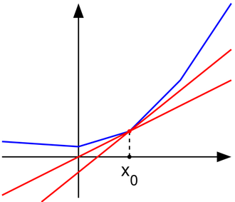
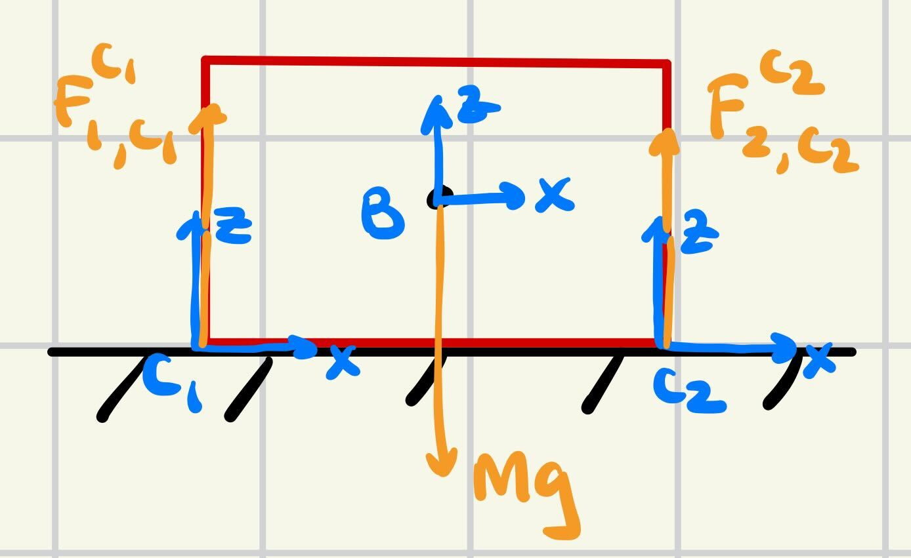
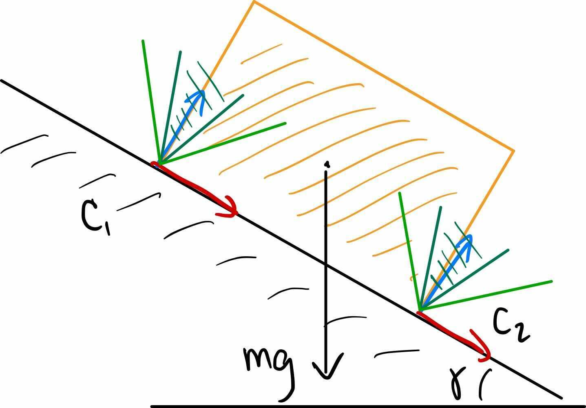

# Bin Picking

All about picking objects randomly assorted in a bin and placing them (either randomly in another bin, or in an organized fashion i.e. for packing).

### Generating Random Object Positions in Simulation

Analog in real life: dumping a bunch of objects randomly into a bin. Realistically in simulation: set objects at random positions + rotations and let them fall out of the sky into the bin. Stagger their z-coords so objects don't overlap --> undefined behavior.

## Notation

Spatial force (aka "Wrench") (6x1 vector, top 3 = torques, bottom 3 = forces):

$$F^{B_p}_{name, C} = \begin{bmatrix}
                        \tau \\
                        f \\
                        \end{bmatrix}$$

$B_p$ = point/origin where force is applied

$C$ = frame

Forces add:

$$F^{B_p}_{total, C} = \sum_i F^{B_p}_{i, C}$$

Forces can b shifted from one application point $B_p$, to another $B_q$:

$$f^{B_q}_C = f^{B_p}_C \space \space \space \space \space \space \space \space \space \tau^{B_q}_C = \tau^{B_p}_C + \space ^{B_q}p^{B_p}_C \times f^{B_p}_C$$

Multiply matrices by rotation vectors to change frame:

$$ f^{B_p}_D = \space ^DR^C f^{B_p}_C \space \space \space \space \space \space \space \space \space \tau^{B_p}_D = \space ^DR^C \tau^{B_p}_C $$

## Static Equilibrium

The general force equation on an object (given contact forces) is expressed as: 

$$ M(q)\dot{v} + C(q,v)v = \tau_g(q) = \sum_i J_i^T(q) F^{c_i} $$

Where $M$ is the mass of the object, $C(q,v)$ is the Coriolis term, $\tau_g$ represents gravity, $F^{c+i}$ is the spacial force due to the $i^{th}$ contact point, and $J_i(q)$ is the $i^{th}$ contact Jacobian, mapping velocities in $i^{th}$ contact frame to spatial velocity.

However, since we're interested only in static equlib. (when $v$ and $\dot{v} = 0$), this is the important equation:

$$ \tau_g(q) = -\sum_i J_i^T(q) F^{c_i} $$

#### Aside: Hydroelastic Contact

Most simulators calculate a single or multiple contact points between penetrating bodies and estimate a force from the contact. Moving the bodies causes discontinuities (for some reason?) --> "exploding" simulations.

Hydroelastic Contact is an alternative to contacts being point forces. Spatial forces between two penetrating bodies are instead calculated as the integral of a "hydrolastic surface" i.e. contact patch; basically considering all possibl points in contact.

## Selecting Contact Frame

Convention: z-axis points toward "contact normal". The direction of the "contact normal" is calculated as a sub-gradient of the signed-distance function between two bodies (sub-gradient is a special type of gradient/derivative that can still calculate an accurate tangent line even)

Sub-gradient example:

 

#### Example: Brick on the ground

 

Our goal is to write the force balance equation to calculate $F^{C_1}_{1,B}$ and $F^{C_2}_{2,B}$.

Call the frame of the brick CoM $B$. In the box's model, we create 4 larger collision spheres in the corners so the contact forces get placed in the corners (otherwise, there would technically be infinitely many valid sets of 2 contact forces on the box).

To write the force balance we must:

1) Put all spatial forces in the same (world) frame:

$$ F^{C_i}_{i,B} = \space ^BR^{C_i} F^{C_i}_{i,C_i} $$ 

2) Put forces/torques on the same application point (note: we use lower-case $f$ to denote the force without the torque): 

$$f^{B}_{i,B} = f^{C_i}_{i,B} \space \space \space \space \space \space \space \space \space \tau^{B}_{i,B} = \tau^{C_1}_{i,B} + \space ^Bp^{C_i}_B \times f^{C_i}_{i,B}$$

3) Static Equilibrium:

$$ F^B_{1,B} + F^B_{2,B} + F^B_{g,B} = 0$$

When solving this force balance for $F^B_{1,B}$ and $F^B_{2,B}$, this generates 3 equations in 2D (6 in 3D).

## (Coulomb) Friction Cone

Define a few constraints for contact forces:
- $\phi(q) > 0 \rightarrow f^{c_i} = 0$ (where $\phi(q)$ is the distance between 2 bodies in configuration $q$): there's no contact force unless there's contact
- $f^{c_i}_{C_i} \geq 0$: force must always oppose penetration, never pull bodies together

Forces in tangential direction to the Normal Contact are due to friction. Coulomb model of friction:

$$ \sqrt{f^{c_i \space 2}_{C_x} + f^{c_i \space 2}_{C_y}} \leq \mu  f^{c_i}_{C_z}$$

Note that we also have separate $\mu_{static}$ and $\mu_{dynamic}$. Basically, the tangential friction force is equal to $\mu_{dynamic} * f^{c_i}_{C_z}$ (friction coeff * normal force) in the dynamic case, and in the static case, the friction force cannot be greater than the friction coeff * normal force. This sort of forms a "friction cone", where the greater normal force (height of the cone) allows greater friction force (radius of the cone). The cone describes the possible range of normal and friction forces for static equilibrium.

Example:

 

Here, the friction cones makes it clar that the smaller $\mu$ (darker green lines) with the thinner cone isn't enough to counteract gravity (the edge of the cone is not able to reach vertical).

Writing the force balance for this example:

$$ f^B_{1,{B_x}} + f^B_{2,{B_x}} = -mgsin\theta$$

$$ f^B_{1,{B_z}} + f^B_{2,{B_z}} = -mgcos\theta$$

$$ -h f^B_{1,{B_x}} + lf^B_{1,{B_z}} = hf^B_{2,{B_x}} + lf^B_{2,{B_z}}$$

$$ f^B_{1,{B_z}} \geq 0, \space \space \space f^B_{2,{B_z}} \geq 0$$

$$ |f^B_{1,{B_x}}| \leq \mu f^B_{1,{B_z}}, \space \space \space |f^B_{2,{B_x}}| \leq \mu f^B_{2,{B_z}} $$

Where $h$ is the hight of the block and $l$ is the length.

The 3rd to last equation is a torque balance to see if the block will rotate. The 2nd to last equation comes from the fact that contact forces must oppose penetration. The bottom equation is Coulomb's friction model.

We can once again use these to solve for $f^B_{1,{B}}$ and $f^B_{2,{B}}$.

## Static Equilibrium as an Optimization Problem

Rather than dropping objects from the sky to create a random arrangement in a bin, we can create an optimizer to solve for one.

Goal: Find configuration $q$ subject to (where ${c_i}$ is each contact point):

$$ \tau(q) = -\sum_i J^T_i(q) f^{c_i} $$
$$ f^{c_i}_{C_z} \geq 0 $$
$$ |f^{c_i}_{C_{x,y}}| \leq \mu f^{c_i}_{C_z} $$
$$ \phi_i(q) \geq 0 $$
$$ \phi(q) = 0 \space or \space f^{c_i}_{C_z} = 0 $$

Non-linear, non-convex problem (TODO: JUSTIFY REASON). The last constraint with the "or" should be converted to something that has a solvable gradent, i.e. ($0 \leq \phi(q), \space f^{c_i}_{C_z} \leq tol$).

## Model-based Grasp Selection

The goal is to "model" contact forces from a gripper on an object in a way that we can evaluate the effectiveness of the grip.

First, we review some math:

Define $\kappa^{B_p}_{name,C}$ as the wench cone corresponding to potential spatial forces for $F^{B_p}_{name,C}$. I.E., for a point contact (which has no torsional friction):

$$\kappa^C_C = \begin{bmatrix}
           0 \\
           0 \\
           0 \\
           f^C_{C_x} \\
           f^C_{C_y} \\
           f^C_{C_z}
         \end{bmatrix} : \sqrt{(f^C_{C_x})^2 + (f^C_{C_y})^2} \leq \mu f^C_{C_z}$$

Wrench cones applied at the same point exprssed in the same fram can be added:

$$ \kappa^{B_p}_{total,C} = \kappa^{B_p}_{0,C} \oplus \kappa^{B_p}_{1,C} \oplus ...$$

Shifting wrench cones from one frame to another is a linear (matrix) operation on the cones:

$$ \kappa^{B_q}_{C} = \begin{bmatrix}
           I_{3 \times 3} \space \space \space \space [^{B_q}p^{B_q}_C]_{\times} \\
           0_{3 \times 3} \space \space \space \space \space \space \space \space \space \space I_{3 \times 3}
         \end{bmatrix} \kappa^{B_p}_{C}$$

Changing the frame the wench cone is expressed in also linear (matrix) operation:

$$ \kappa^{B_p}_{D} = \begin{bmatrix}
           ^DR^C \space \space \space \space 0_{3 \times 3} \\
           0_{3 \times 3} \space \space \space \space ^DR^C
         \end{bmatrix} \kappa^{B_p}_{C}$$

In practice, we put all wrench cones from all contact points between object and gripper into a common frame and sum the wrench cones together. This resulting wrench cone, called the *contact wrench cone*, is the possible wrenches that the object in the gripper can take without moving within the grippers.

Therefore, a good grasp on an object --> large contact wrench cone.

#### Colinear Antipodal Grasps

For 2-finger gripper, "Antipodal" --> contact forces are in colinear, in perfectly opposite directions. This is fairly strong heuristic for grasping to maximize contact wrench cone.

## Grasp Selection from Point Clouds

Goal: from (unsgemented) Point Cloud, identify graspable areas.

### Point Cloud Pre-processing

First, we crop the PC to be within the area of the bin. Next, we merge the PC's from our multiple camera perspectives by simply concatenating them (this is assuming all cameras are perfect; impractical in real life). Lastly, downsample the PC (to reduce # of points/remove unecessary points) by using voxel grid; 1 point per voxel.

See Meshcat for example (use checkboxes in Scene -> meshcat): https://manipulation.csail.mit.edu/data/mustard_bottle_point_clouds.html

### Estimating Normals

Part of PC pre-processing is estimating the normal direction for each point in the PC relative to the surface of the object. 

To do this, we fit planes to nearby points to each point in the PC. If we describe the plane with position $p$ and unit length normal vector $n$, the distance betwen a point $p^i$ and plane is simply $|(p^i-p)^Tn|$, the absolute value of the dot product between $n$ and $p^i-p$ (remember that dot product is the product of the magnitudes of the parallel components of the 2 vectors (and $n$ has length 1)). Our goal, when fitting a plane to a set of points, is to minimize the distance between the plane and all the points (represented by this objective):

$$ \min\limits_{p,n} \sum_{i=1}^N |(p^i-p)^T n|^2, \space \space \space subject \space to \space |n| = 1 $$

However, solving for $p^*$ is kind of trivial (avg of all points):

$$ p^* = \frac{1}{N} \sum_{i=1}^N p^i $$

Solving for $n$ is the hard part. Plugging $p^*$ back into objective:

$$ \min\limits_{n} n^TWn, \space \space \space subject \space to \space |n|=1, \space \space \space where \space W=[\sum_i(p^i - p^*)(p^i - p^*)^T] $$

The solution $n$ to this optimization is the (unit-length) eigenvector of the smallest eigenvalue of $W$. 

Because $W$ is symmetric, it has orthogonal eigenvectors, so the other 2 eigenvectors of $W$ with $n$ form a basis. The eigenvector of the largest eigenvalue is the directon of least curvature.

### Planning Good Grasps

General idea: find areas/patches with nearly colinear normals --> good antipodal grasp.

Therefore, we define the cost of a gripping strategy as the negative of the sum over all points that fall in the contact region with the gripper, of the component of the normal that is perpendicular to the gripper pad.

$$ cost = -\sum_i (n^i_{G_x})^2 $$

where $n^i_{G_x}$ is the $x$ component of the $i^{th}$ point in the cropped point cloud expressed in gripper frame.

We can also add a cost associated with the hand deviating from vertical:

$$ cost += -\alpha[0 \space 0 \space -1] R^G \begin{bmatrix}
           0 \\
           1 \\
           0 
         \end{bmatrix}$$

$\alpha$ is the weight of this cost, and we are doing a dot product of the y-axis of the gripper (rotated in to World frame) with $[0 \space 0 \space -1]$, the desired world rotation of the gripper. So the more parallel the y-axis of the gripper is with the world's negative z-axis, the more we decrease from the cost.

Therefore, goal is to find $G_x$ that minimizes this cost. This is non-convex, and usually the cost is 0 with gradient 0 (when there are no points between the grippers). Instead of using numerical solvers, we often do random sampling with heuristics.

1 heuristic is to orient the gripper so the gripper pads are normal to the normals, and the length of the fingers are parallel to the direction of maximum curvature of the PC. Finally, to constraint the gripper in all axes, move the gripper until the object falls between the fingers. This heuristic is only good for objects with curvature.

Another heuristic is to pick any antipodal pair of points (sample points randomly, and extend the normal to see if there are any sufficiently antipodal points), then sample some gripper positions around that antipodal point. With every sample, evaluate the cost and pick the best one.