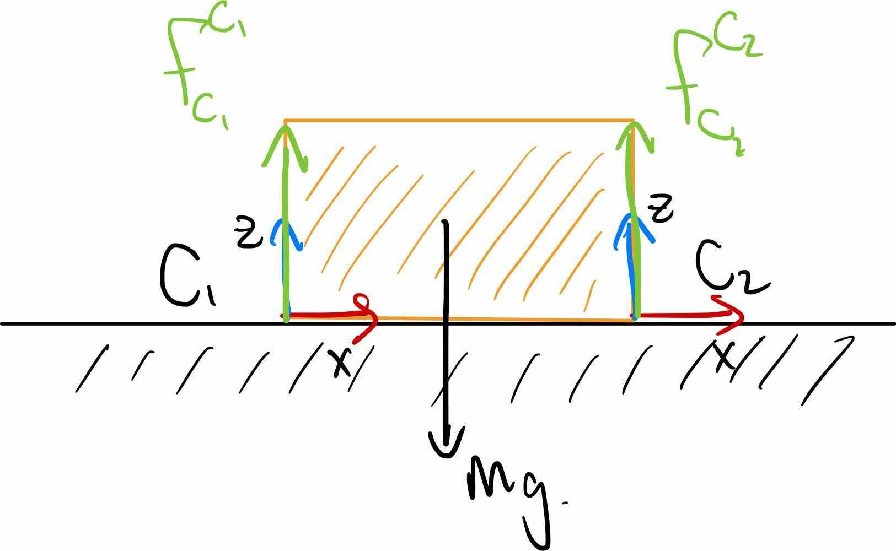

# Bin Picking

## Notation

Spatial force (6x1 vector, top 3 = torques, bottom 3 = forces):

$$F^{B_p}_{name, C} = \begin{bmatrix}
           \tau \\
           f \\
         \end{bmatrix}$$

$B_p$ = point where force is applied

$C$ = frame

Forces add:

$$F^{B_p}_{total, C} = \sum_i F^{B_p}_{i, C}$$

Forces can b shifted from one application point $B_p$, to another $B_q$:

$$f^{B_q}_C = f^{B_p}_C \space \space \space \space \space \space \space \space \space \tau^{B_q}_C = \tau^{B_p}_C + \space ^{B_q}p^{B_p}_C \times f^{B_p}_C$$

Multiply matrices by rotation vectors to change frame:

$$ f^{B_p}_D = \space ^DR^C f^{B_p}_C \space \space \space \space \space \space \space \space \space \tau^{B_p}_D = \space ^DR^C \tau^{B_p}_C $$

## Static Equilibirium

#### Example: 

 

Call the frame of the brick CoM $B$.

1) Put all forces in world frame:

$$ F^{B_{C_i}}_{1,B} = \space ^BR^{C_1} F^{B_{C_i}}_{1,C_1} $$ 

2) Put forces/torques on the same application point

$$f^{B}_{1,B} = f^{B_{C_1}}_{1,B} \space \space \space \space \space \space \space \space \space \tau^{B}_{1,B} = \tau^{B_{C-1}}_{1,B} + \space ^Bp^{B_{C_1}}_C \times f^{B_{C_1}}_{1,B}$$

3) Static Equilibrium:

$$ F^B_{1,B} + F^B_{2,B} = F^B_{g,B}$$

## Friction Cone

 

Coulomb Friction (where $\mu$ is a friction coefficient): $ |f_{tangent}| \leq \mu f_{normal} $

The greater the friction coeff, the wider the cone. The stronger the normal force, the taller the cone.

Any force within the friction cone 

## Selecting Contact Points

