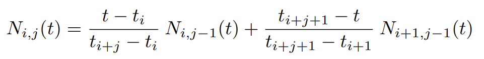

# Motion/Trajectory Planing

The goal of this page is to design a trajectory of joint positions for the robot to follow.

**Random Note**: OMPL (Open Motion Planning Library) has open source implementations for many algorithms.

## Inverse Kinematics (IK)

Why this is different from Differential IK (in the Dyamics Notes): Diff IK takes partial derivates of joint positions to produce Jacobian, and solve for joint velocities that result in end effector velocities. IK is simply solving for joint angles that produce end effector pose. 

For trajectory planning, IK is often used.

One way to solve the IK problem is just like this: 

$$ q = f_{kin}^{-1}(X^G) $$

where $f_{kin}$ is the forward-kinematic function that maps $q$ to $X^G$ (like so: $X^G = f_{kin}(q)$).

However, they break down once we have inequality constraints, and are less flexible in terms of customizing costs, contraints, and picking a solution when there are many.

A better, more explicit method is to use optimization:

$$ \min\limits_{q} |q - q_0|^2 $$
$$ subject \space to \space \space \space X^G = f_{kin}(q) $$

Basically, we set some $q_0$ that is a generic "comfortable" position, and an extremely simple cost function that prefers joint positions near the "comfortable position". We then add all our other requirements (i.e. end effector position, non-collision) as constraints.

Implementation in Drake:

<center></center><br />

We're setting `pose.translation()` as both the lower and upper bound for the position constraint, and th desired rotation as the rotation constraint. We use $|q - q_0|^2$ as the cost.

Optimization gives us the chance to use tons of different constraints (i.e. relative position/orientation of 2 bodies, min. distance between 2 bodies)

Another example of constraints, that require the gripper to be in a "grabbing" position of a cylindrical rod:

```Python
ik.AddPositionConstraint(
    frameB=gripper_frame, p_BQ=[0, 0.1, -0.02],
    frameA=cylinder_frame, p_AQ_lower=[0, 0, -0.5], p_AQ_upper=[0, 0, 0.5])
ik.AddPositionConstraint(
    frameB=gripper_frame, p_BQ=[0, 0.1, 0.02], 
    frameA=cylinder_frame, p_AQ_lower=[0, 0, -0.5], p_AQ_upper=[0, 0, 0.5])
```
<center></center><br />

[0, 0.1, 0] is the point in gripper frame in the middle between the 2 fingers. [0, 0.1, 0.02] and [0, 0.1, -0.02] are points equidistant from the 2 fingers, but shifted "left"/"right". We're saying that these 2 points in gripper frame must coincide with the center of the cylinder, +/- 0.5 meters in the z-axis (the length of the cylinder).

A simple constraint in Drake for total non-collision:
```Python
ik.AddMinimumDistanceConstraint(threshold)
```

Can also add filters so the collision constraint only applies to certain objects. Behind the scenes, checks minimum distance between all objects in the scene.


Examples of some IK solvers in Drake: https://deepnote.com/workspace/michael-zengs-workspace-61364779-69ef-470a-9f8e-02bf2b4f369c/project/06-Motion-Planning-Duplicate-c2fb7d28-4b8e-4834-ba5a-a1d69c1d218b/notebook/interactive_ik-64af78e8866a4750932bdb25344edef0?


This provides a visual of an optimization:

This specific optimization is iiwa reaching into a shelf; it has a 2D decision variable (X and Y axes of the visualization) because the iiwa is planar and one of it's joints was locked at 0, and the Z-axis is the cost (note that a higher-dimensional optimization problem would not be visualizable).

https://manipulation.csail.mit.edu/data/shelf_ik_prog.html

The green is the cost, and each constraint (which can be turned on/off in the controls) is either red or blue; red --> infeasible region, blue --> feasible region. Non-linear optimizers need to solve this problem to find the lowest green point where all constraints are blue. 


### Offline vs Online Optimization Solvers

We have a problem: non-linear optimization is a hard problem; online solvers like SNOPT are good and fast, but have no guarantees; i.e. may not find global min. solution, or may not find a solution at all even if there is one. Global solvers are too slow to be real time, but good for applications like creating training data for a RL model (to replace the optimizer), or for two-stage optmizers (with an offline "building" phase and online "query" phase).

Drake also have `GlobalInverseKinematics` to help solve for global minimums.

## Grasp Planning using IK

Previously (in Bin Picking Notes), we chose a grasp by sampling & evaluating an objective that rewarded grasping from above the object.

A slightly better approach, which we'll describe briefly here, is to use optimization, and optimize considering both picking and placing with two decision variables: $q_{pick}$ and $q_{place}$. We'll constrain $^OX^{G_{pick}} = ^OX^{G_{place}}$, which means that the gripper position relative to the object is constant (obj doesn't move in gripper). (Everything beyond this point is a guess). Our cost function for this optimization can be the same as above, $|q_{pick} - q_0|^2 + |q_{place} - q_0|^2$ (which prefers positions closer to the "comfortable" position), and with the additional constriants that $q_{pick}$ should produce an antipodal grasp, $q_{place}$ should place the object where we want it.

## Trajectory Optimization

To solve the entire trajectory, instead of performing an optimization for every $q$ in the trajectory, we optimize the whole trajectory at once:

$$ \min \limits_{q_0, ... ,q_N} \sum_{n=0}^{N-1} | q_{n+1}-q_n | ^2  $$
$$ subject \space to \space \space \space q_0 = q_{start},$$
$$ \space \space \space \space \space \space \space \space \space \space \space \space \space \space \space \space \space \space \space q_N = q_{end},$$
$$ \space \space \space \space \space \space \space \space \space \space \space \space \space \space \space \space \space \space \space  \forall n, \space non-collision $$

Here, we're minimizing the sum of squared distances between adjacent points in the path, in order to spread the distance evenly. This is a very basic path that consists of just line segments. Note that the non-collision constraint is dangerous; we only check non-collision at the $n$ sampled points, not over the entire trajectory.

Another more practical optimization for the trajectory (with the cost being time taken):

$$ \min \limits_{\alpha, T} T $$

$$ subject \space to \space \space \space X^{G_{start}} = f_{kin}(q_{\alpha}(0)),$$
$$ \space \space \space \space \space \space \space \space \space \space \space \space \space \space \space \space \space \space \space X^{G_{goal}} = f_{kin}(q_{\alpha}(T)),$$
$$ \space \space \space \space \space \space \space \space \space \space \space \space \space \space \space \space \space \space \space  \forall t, \space |\dot{q}_{\alpha}(t)| \leq v_{max} $$

Basically, we find a trajectory, $q_{\alpha}(t)$ for all $t \in [0, T]$ that the gripper moves from start to goal in minimum time. We parameterize the trajectory using $\alpha$ and optimize using $\alpha$ (and $T$) as the decision variables. In this parameterization, $\alpha$ are the control points of a 7D B-spline (in joint configuration space) trajectory (similar to the control points of a bezier curves) (each control point is equally spaced in time). Using the B-spline "basis function", the optimizer can translate $\alpha$ into a continuous function of positions $r(s)$ where $s \in [0, 1]$, which we can then convert to $q(t)$ by rescaling time from $[0,1]$ to $[0,T]$, where $T$ is the true duration of the trajectory ($q(t) = r(t/T)$). 

The last equation represents velocity limits for each joint. We can also add constraints that ensure the start/end velocity are 0, and non-collision constraints for all $t$. Also, we can add a multiplier to the cost equal to $|q_{\alpha} - q_0|^2$ to prefer "comfortable" positions.

Why a B-spline specifically?
- Derivatives of B-splines are still B-splines (with degree reduced by one), with coefficients that are linear in the original coefficients. This makes it easy to add velocity, acceleration constraints
- The coefficients of the B-spline, called the "control points", have a strong geometric interpretation.
- The B-spline is guaranteed to be within the area bounded by the control points (aka, within the "Convex Hull" of the control points). This is especially nice because we can add a constraint that all control points are within the joint limits, which guarantees that the trajectory is entirely within joint limits.

Note on number of B-spline control points: a higher dimensional decision var --> need more control points for the B-spline. I.e. for 7 joints, 10 control points is a good middle-ground.

Joint limits and velocity limits get encoded as linear constraints. However, acceleration, jerk, etc. are non-linear.

With non-linear constraints, the optimizer can get stuck in local minima. Sometimes, it's a good idea to run the optimizer multiple times with different initial guesses (i.e. run it once without anti-collision constraints, then run it a second time with anti-collision). For example, the Multi-Start Algorithm.

One problem with this B-spline parameterization is that it requires manually adding non-collision constraints for $q(t)$ at many $t$. Just checking non-collision at the control points of the B-spline does not necessarily mean the entire trajectory is out of collision. And Drake's `MinimumDistanceLowerBoundConstraint` will only check at a modest, discreet interval in the trajectory.

Other Kinematic-Optimzation-based trajectory planners to research: *CHOMP*, *STOMP*, *KOMO*

### Trajectory Optimization Success and Runtime

With heavy constraint, traj opt may fail. Tricks to help it succeed:
 - Multi-start for many initial guesses
 - Initial guess based on IK - use IK at start and end pose, then linearly interpolate to create a basic trajectory (note: lin. interp. of joint positions does not produce a linear path; it looks more circular, but it's better than a completely random guess)
 - Run traj opt in a loop, starting with loose constraint at loop 0, with progressively tighter constriants in later loops. Run until failure.

Traj. Opt. may not also run real-time out of the box. Tricks to help speed it up:
 - Use the previous solve as an initial guess for the next solve
 - Warm starting: maintain the internal state of the optimizer between solves
 - According to Russ, these two tricks should be enough.


## Sampling-Based Trajectory Planning

Due to limitations of optimization-based trajectory planning (i.e. local minima), sampling-based algorithms have become more popular.

There are 2 core algorithms/categories of algorithms for sampling-based Trajectory Planning; RRT and PRM.

Note: oftentimes, especially if you care about smooth/B-spline type trajectories, these sampling-based algorithms can be used to create initial guess for an optimization-based trajectory planner.

### RRT - Single-query Planner

Good when environment/configuration space is unknown. Note: it's called "single-query" because each graph produced by RRT is used for a single query.

**Basis Description:** Loop: pick random point $p_{ran}$ in configuration space. Find nearest point in current tree $p$ to $p_{ran}$. Grow a new node in the tree with $p$ as its parent in the direction of the $p_{ran}$ a distance $RADIUS$ from $p$. Note: $RADIUS$ can decrease over time to switch form large exploration to more fine detail exploration.

**One Flaw: Voronoi-bias:** A Voronoi region of a node $p$ in the tree is a region defined/bounded by the peripendicular bisectors of the segments drawn from $p$ to all of its neighbors. For example: the Voronoi region of the left-most node in this tree is shaded in green (all the green lines are equidistant from 2 nodes).

<center></center><br />

Nodes at the "fringes" of the tree have bigger Voronoi regions --> more likely to be grown from at the start of the algorithm. Likes to branch out far in a few directions, then explore the details of each direction.


### PRM (Probabilistic Roadmap) - Multi-query Planner

Better than RRT if the configuration space/environment is always the same; therefore, can build the tree beforehand, offline. Note: it's called "multi-query" because each graph produced can be re-used for multiple queries or start/end positions.

**Build Phase (can be done offline):**
1. Randomly samples positions ("vertices") in 7D "configuration space" (for a 7D robot); determines which are safe vs in-collision (with obstacle). Note that configuration space is the space where each dimension spans from $0$ to $2 \pi$ and wraps around to 0; it doesn't look at all like 3D physical space.
2. Randomy creates edges between safe vertices that are less than $radius$ distance apart (and check that the edge is safe as well)

**Query Phase (must be done online):**

3. Finds shortest path from start vertex to target vertex following these edges (i.e. using A*)

If obstacles move, you can reuse vertices, but must recompute them all to see if they are now in-collision, and based on this, create new edges.

*Note: PRM paths are not smooth by default; we usually apply a smoothing algorithm after.*

This basically converts searching for a path to a graph-search problem, which is easily solvable.


### An Aside: A Flaw to both RRT and PRM

Even if the vertices in the graph don't fall within obstacles, it's possible that edges/the straight-line trajectories between vertices do. The simplest solution to this is to increase the resolution at which vertices are placed. Another method is to check that the entire edge doesn't cause collisions.


## Graphs of Convex Sets (GCS)

Algorithm recently invented by Tedrake's Lab, adapted/improved from PRM.

Main selling point: probabilistic, so good at finding global optimum, but still produces smooth/optimal paths.

In offline "build" step, after picking a random sample, create a convex region around the random sample. (*IRIS*: algorithm to create approximate convex decomposition of collision-free configuration space). Using these convex regions, we build a GCS (graph of convex sets) where each region is a node, and nodes are connected if the convex regions overlap. During online "query" step, instead of picking vertices to connect to create the final trajectory, select a sequence of convex regions, then optimize B-splines with control points within those convex regions to create optimal (in time, energy, whatever cost function you use), continuous curve path at the end.

<center></center><br />


Roughly the way *IRIS* works is by finding separating hyperplanes between a randomly sampled point in configuration space and obstacles. Use an iterative algorithm to maximize the size of the convex region by re-sampling hyperplanes.

To speed up *IRIS*, we can also give it initial guesses based on PRM. So, we first run PRM on the configuration space, then find "cliques" in the resulting graph (area of inter-connected nodes), which usually form nice convex shapes that are well spaced out, then feed that as initial guesses for *IRIS*, whch will then expand those convex regions to be as large as possible. 

<center></center><br />

<center>Left: PRM Output. Middle: Cliques, initial guesses for *IRIS*. Right: *IRIS* output.</center>


<br />

Now, to turn the *IRIS* convex regions into a continuous path, we make 2 observations:
- Connecting 2 points in a convex region with a line means the line will be entirely in the convex region. We can also extend this to say that we can create any B-spline within the convex region whose control points are within the convex region (recall that a B-spline remains within the convex hull of its control points).
- If there is a point at the intersection of 2 convex regions, the point can be used as a connection between segments in dfferent convex regions.

This means, when we traverse the GCS graph to create the path, at every node/convex region we visit, we need to select $x$ points from that region to add to the path, and ensure that the last point of the former convex region is the first point of the next convex region (and must fall in the intersection of the 2 regions). $x$ here is the number of control points we want to use to define the B-spline in each convex region. 

Example where $x$ = 3:
<center></center><br />

Note: I don't understand the time rescaling


Expressing this as an optimization:

<center></center><br />

$a$ is a weight for the Time objective, $b$ is a weight for a path length objective, and $c$ is a weight for an energy (velocity squared) objective. The first (equality) constraint says that curves must be continuous up to degree $n$, the second constraint says that all $q$ must fall in the union of the convex regions, and the last constraints encode velocity bounding box limits, time, and initial position/velocity.

The way we would actually express the continuity constraint as a function of the decision variables is by setting the derivative of the end of one B-spline equal to the derivative of the start of the next B-spline. This results in a continuous path because B-splines are colinear to their tangent lines at the start/end points.

## Appendix A: B-Splines

[[source]](https://www.youtube.com/watch?v=qhQrRCJ-mVg)

#### An Aside: Bezier Curves

Bezier curves are defined by a pretty simple parametric formulation (recall that a Bezier curve of degree $n$ has $n+1$ control points):

<center></center><br />


Where $P_i$ is the $i^{ith}$ control point, and $t \in [0,1]$.

For example, expanding this out for a cubic:

<center></center><br />


This can also be expanded out to matrix form (this is still the cubic example):

<center></center><br />


Multi-dimensional Bezier curves are very similar, won't go into detail, but they just have multiple parameters $t$ (i.e. $C(t_1, t_2)$ for a 2D "Bezier Surface"). You then also need $(n+1)^d$ control points, where $d$ is the number of dimensions.

<center></center><br />


#### Back to B-Splines

Basically: bunch of Bezier curves pasted together at their endpoints. A $k$ deg. B-spline w/$n+1$ control points consists of $n-k+1$ Bezier curves. Notice how, for B-splines, $k$ (deg) and $n+1$ (# control points) can be anything, unlike for Bezier curves wheren $k=n+1$.

B-splines have C2 continuitity: where the Bezier curves join together, the endpoints of the Bezier curves have the same position, derivative of position, and double derivative.

Definition: given control points $Q_i$ of any dimension:

$$ X(t) = \sum_{i=0}^n N_{i,d}(t) * Q_i $$

$N_{i,d}(t)$ Are the B-spline basis functions. To define the basis functions, first, let's select a weakly increasing sequence of scalars, $t_i$, for $0 \leq i \leq n+d+1$. This sequence $T=(t_0, t_1, ..., t_{n+d+1})$ is called the *knot vector*, with each $t_i$ being a *knot*. For "Uniform" B-splines (which are used 99% of the time), we simply define $T=(0,1,2,...,n+d+1)$.

The basis functions are defined recursively, with base case:

$$ N_{i,0}(t) =  \begin{cases} 
    1 & \text{if } t_i \leq t < t_{i+1} \\
    0 & \text{otherwise} 
\end{cases}$$

The recursion is defined like so:

<center></center><br />

**How to interpret this:**

Notice that there are $(n+1) * d$ basis functions; $d$ (for each dimension) for each $i$ (control point).

The base case of is like an "on/off" function; if the current value of $t$ is between $t_i$ and $t_{i+1}$, then we turn that basis function on; otherwise turn it off. Recall that a B-Spline is basically a bunch of Bezier curves connected together; this on/off function is basically turning on the basis function for the Bezier curve corresponding to the current value of $t$. At any given $t$, there can be up to $d$ basis functions that are on at once.

The recursive case outputs an equation for the basis function in terms of $t$, where all $t_i$ have an assigned value in the knot vector (in the case of Uniform B-Splines, simple $t_i=i$).

If we expand out the algebra to solve for all $N_{i,j}$, the plug in to the equation $ X(t) = \sum_{i=0}^n N_{i,d}(t) * Q_i $ above, we get an equation for the B-Spline; at every $t$, the B-spline will be a sum of up to $d$ basis functions times their control points.

There's one caveat; at the start and end of the B-spline, when $i$ is close to $0$ or $n$, the B-spline will be the sum of fewer than $d$ basis functions; in these regions, the B-spline is not defined (if you try to plot it, you'll get something weird). We have to make a modification to the "Uniform B-spline": The "Open Uniform B-spline". Won't go into it, but you basically make the first few knots equal and the last few knots equal, and then, the B-spline will start and end at the first and last control points.