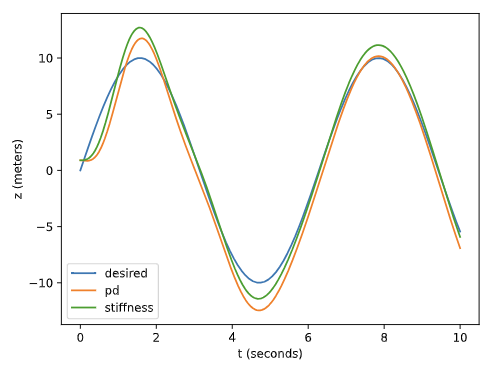

# Manipulator Force Control

All robot joints have low-level controllers that execute high level commands. I.E. for a commanded joint position/velocity/force, the low-level controllers convert these to motor commands.

There are many different possible low-level controllers the iiwa can use (that are implemented in Drake):
 - `PidController`
 - `InverseDynamicsController`
 - `SpatialForceController`
 - `JointStiffnessController`
 - `SpatialStiffnessController`

They all take the current state and desired state as input, and output "generalized force" (motor torque/current command). Some controllers also take other inputs (i.e. `InverseDynamicsController` takes desired acceleration; `SpatialStiffnessController` takes both desired pose and spatial velocity).

## A Simple Model

Let's begin in 2D, and consider a manipulator that is a point mass (so it can only push things), along with 1 object. The object has an $x$, $z$, and $\theta$. The manipulator just has an $x$, $z$.

To model the forces on the manipulator (this is just $F=ma$):

$$ \begin{bmatrix}
m & 0 \\
0 & m
\end{bmatrix} \begin{bmatrix} \ddot{x} \\ \ddot{z} \end{bmatrix} = \begin{bmatrix} 0 \\ -mg \end{bmatrix} + \begin{bmatrix} u_x \\ u_z \end{bmatrix} + f^{R_c}$$

where $f^{R_c}$ denotes the contact force on the robot manipulator $R$ at point $c$ from contact with the object, and $u$ is the control force given to the robot. At least, we might have the robot controller try to push the object with a force $f^{R_c}$. The equal and opposite force on the object $B$ is $f^{B_c} = -f^{R_c}$. 

## Low-level Control for Trajectory Tracking

Below, we describe some low level controllers to translate position/velocity errors (between a robot's real trajectory and desired trajectory) into joint torque commands. For simplicity, we just describe controllers for the simple model described above (a 1D point-mass manipulator).

### `PidController` (or, technically, PD Controller)

Integral term typically ommitted; can get dangerous, i.e. if arm gets stuck against a wall, integral will go up without bound.

PID is usually used in the context of position control. The output of the PID is simply motor command $u(t)$ (so $k_p$, $k_i$, $k_d$ map from position error to commanded joint torque).

$$ u = k_p(z_d - z) + k_d(\dot{z_d} - \dot{z}) $$

Performance is generally bad:

 

Especially if manipulator affected by gravity, causes steady-state error. This can be seen by showing the net force equation for the manipulator (assuming no contact forces, just trying to follow a sin wave trajectory):

$$ m \ddot{z} = -mg + k_p(z_d - z) + k_d(\dot{z_d} - \dot{z}) $$

So, if arm happens to have 0 velocity, 0 acceleration, then:

$$ 0 = -mg + k_p(z_d - z) $$
$$ z_d - z = \frac{1}{k_p} mg $$

The PID will have no control output for a non-zero $z_d - z$.

### `JointStiffnessController`

Similar to the PD controller, but also takes into account gravity.

$$ u = mg + k_p(z_d - z) + k_d(\dot{z_d} - \dot{z}) $$

Checking the net force equation again:

$$ m \ddot{z} = k_p(z_d - z) + k_d(\dot{z_d} - \dot{z}) $$

We see that the acceleration of the arm will go to 0 whenever there is no position and velocity error. So, if the desired trajectory is stationary ($\ddot{q_d} = 0$), there will not be any error. However, if $\ddot{q_d}$ is non-zero, error will arise:

 

### `InverseDynamicsController`

Modify `JointStiffnessController` by adding $\ddot{q}_d(t)$ feedforward term. Basically, whenever we want the manipulator to accelerate, this adds extra torque to achieve that acceleration; the robot actively follows what it knows the trajectory wants it to do.

$$ u = mg + m(\ddot{z}_d(t) + k_p(z_d - z) + k_d(\dot{z_d} - \dot{z}))$$

However, there's another key difference: we're now multiplying $m$ to all the PD terms. $m$, for a point-mass manipulator, is a scalar, but depending on the position of a real arm and any external forces on it, $m$ becomes a matrix representing moments of inertia. Multipling by $m$ further improves performance (at least on a real robot arm) because, logically, we should apply more torque to the motors if the robot is more massive.

Once again analyzing the net force equation resulting from this control policy, we get: 

$$ m \ddot{z} = m \ddot{z} + k_p(z_d - z) + k_d(\dot{z_d} - \dot{z}) $$

We can see that, when there is no position and velocity error, the arm will follow the acceleration of the desired trajectory. 

This achieves the best performance:

 

Another note: adding a gravity term in $u$ allows for smaller $k_p$ and $k_d$ gains (since more aggressive gains would help cancel gravity), which is better. Smaller gains = "looser" or less "stiff" trajectory following, so if your trajectory needs to make contact with objects, applying less force to those objects in the case of error.

## `SpatialForceController` (aka Direct force Control)

Controlling position/velocity/acceleration falls apart when there are significant contact forces. So, we design a new controller: takes desired contact forces, produces generalized force inputs to the robot to create that contact force.

Force control is great for manipulating unknown geometries. Using position control, you need to know exact desired positions. With force control, just keep applying force until it works.

Aside: legged-robots also are much better with force control. They might use position control when lifting/swinging the leg, but always use force control when making contact wth ground. Requires less accuracy/perfect terrain when walking, just ensures weight of the robot is always held.

Consider the simple case when the robot is in contact/pushing an object: acceleration of manipulator is $\approx 0$. Then, net force becomes (where $f^{R_c} $ is the force from robot on object at contact point $C$): 

$$ f^{R_c} = \begin{bmatrix} 0 \\ -mg \end{bmatrix} - \begin{bmatrix} u_x \\ u_z \end{bmatrix} $$

Therefore, the desired motor command is:

$$ u = \begin{bmatrix} 0 \\ -mg \end{bmatrix} - f^{R_c}$$

When the robot is not in contact, then the manipulator will accelerate, specifically in the opposite direction of $f^{R_c}$, which would usually move the manipulator toward the object to be pushed.

### Example: Flipping up a box

This is an example of a very specific manupulation task that can be solved most easily with direct force control.

Goal: flip the box from its belly onto its side using the point-mass manipulator:

 

There are 2 contact points, between manipulator (the point mass) and box which has a frame we'll call $C$ with normal pointing into the box, and between the box and ground, which we'll call $A$ with normal pointing vertically up. Let's define some helpful rotations now which we'll use later:

$$ ^BR^C = R_y(-\frac{\pi}{2}), \space \space \space \space ^WR^A = I $$

The rotation between $C$ and the box $B$ is a $-\frac{\pi}{2}$ because $C$'s z-axis points straight into the box (note: by convention, positive-z is always normal to the contact in the contact frame), aligned with $B$'s x-axis. The rotation of $A$ is $0$ relative to the world.

We want to use direct force control, so our eventual goal is to calculate the desired cotact force from the manipulator. To do that, let's start calculating all the forces on the box. Starting with gravity:

$$ f^{B_{CoM}}_{gravity,W} = mg $$

Next, normal forces. We can create some inequality constaints to ensure that the finger and ground only apply "pushing" forces on the box:

$$ f^{B_C}_{finger,C_z} \geq 0 $$
$$ f^{B_A}_{ground,A_z} \geq 0 $$

These constraints literally show that the Z-component of the force from the finger/ground on the box at point C is non-negative (always a pushing force).

Lastly, the friction forces (and friction cones) of both contact points create inequality constraints (to ensure neither the manipulator nor the box slip):

$$ |f^{B_C}_{finger,C_x}| \leq \mu_C f^{B_C}_{finger,C_z} $$

$$ |f^{B_A}_{ground,A_x}| \leq \mu_A f^{B_A}_{ground,A_z} $$

Since our goal is to rotate the box around $A$ (with point $A$ remaining fixed), we calculate the net torque around $A$. This will help us relate the manipulator contact force (what we're trying to solve for) to the rotation of the box:

$$ \tau^{B_A}_{total,W} = \tau^{B_A}_{gravity,W} + \tau^{B_A}_{ground,W} + \tau^{B_A}_{manipulator,W} $$

(We know $\tau^{B_A}_{ground,W} = 0$ because the force from the ground is applied at the center of rotation).

Note also, that we don't know $\tau^{B_A}_{gravity,W}$ because we technically don't know the geometry of the object (or the lever arm of the torque).

One control strategy is to use PID to control the rotation angle $\theta$ between the box and ground (assuming we are able to estimate $\theta$ somehow):

$$ \tau^{B_A}_{manipulator,W} = PID(\theta_d, \theta) $$

We can easily convert the $\tau^{B_A}_{manipulator,W}$ into a desired contact force $f^{B_C}_{finger,C_x}$ to feed to the robot controller using a factor of the $^Bp^C$; since we don't actually know the geometry of the box, we can estimate a reasonable number.

We can solve the PID directly to get the desired contact force $f^{B_C}_{finger,C_x}$, but then it would be hard to encode the many constraints from friction and normal forces. Instead, we re-express the PID as an optimization:

 

This will calculate the desired contact force $f^{B_C}_{finger,C_x}$, satisfying the constraints (so the box doesn't slip or move at point $A$), to rotate the box. (I think the constraints are expressed confusingly here; the last constraint can just be removed, and instead express $f^{B_C}_{finger,C_z}$ and $f^{B_A}_{ground,A_z}$ in terms of gravity and the normal components of the finger contact force).

Note that we also need good estimates of friction coefficients and mass of the object.

## Indirect Force Control/Impedance Control

This is commonly used in "human-friendly" robotics. It's a much safer/less-sensitive/intuitive way to manipulate objects (you don't have to get all the forces spot-on; the physics gives margin for error), but less precise.

Instead of directly setting desired contact force to some value, we set the desired contact force desired equal to some spring/damped response to an offset in desired position:

$$ f^{R_c} = m \begin{bmatrix} \ddot{x} \\ \ddot{z} \end{bmatrix} + b \begin{bmatrix} \dot{x} \\ \dot{z} \end{bmatrix} + k \begin{bmatrix} x-x_d \\ z-z_d \end{bmatrix} $$

(recall $f^{R_c}$ = desired contact force on robot from object)

This depends solely on the current velocity, acceleration, and position error of the manipulator. The equation is the differential equation for a linearly damped spring sytem. So, what this controller basically does, is put the manipulator on a virtual spring-damper connected to a virtual setpoint $(x_d, z_d)$. Wherever you place $(x_d, z_d)$, the manipulator will follow in a spingy/damped motion.

We tune parameters $b$ and $k$ to get the desired "springiness" that we want. For just Indirect Force Control, we would set $m$ to the mass of the manipulator, but, for full Impedance Control, we can also treat $m$ as a parameter to be tuned.

More generally, we can also turn $b$ and $k$ into matrices, $K_d$ and $K_p$, so impedance in different axes can be different:

$$ f^{R_c} = m \begin{bmatrix} \ddot{x} \\ \ddot{z} \end{bmatrix} + K_d \begin{bmatrix} \dot{x} \\ \dot{z} \end{bmatrix} + K_p \begin{bmatrix} x-x_d \\ z-z_d \end{bmatrix} $$

To turn this desired contact force into an actual control law, we analyze the resulting dynamics (basically using F=ma):

$$ m \begin{bmatrix} \ddot{x} \\ \ddot{z} \end{bmatrix} = mg + u + f^{R_c} $$

Plugging in $f^{R_c}$:

$$ m \begin{bmatrix} \ddot{x} \\ \ddot{z} \end{bmatrix} = mg + u + m \begin{bmatrix} \ddot{x} \\ \ddot{z} \end{bmatrix} + K_d \begin{bmatrix} \dot{x} \\ \dot{z} \end{bmatrix} + K_p \begin{bmatrix} x-x_d \\ z-z_d \end{bmatrix} $$

Simplifying: 

$$ u = -mg - K_d \begin{bmatrix} \dot{x} \\ \dot{z} \end{bmatrix} - K_p \begin{bmatrix} x-x_d \\ z-z_d \end{bmatrix} $$

<!-- More general form of the equation:

$$ m \space {}^W\dot{v}^R + K_d \space {}^Wv^R + K_p (^Wp^R -{}^Wp^{R_d}) = f^R $$

where $^Wp^R = \begin{bmatrix} x \\ z \end{bmatrix}$, the position of the manipulator in world frame (likewise for ${}^Wv^R$ being velocity).

If we wanted to express $K_d$ and $K_p$ in a frame $A$ other than world frame, we could multiply them by $^WR^A * K * {}^AR^W$:

$$ m \space {}^W\dot{v}^R + ^WR^A K_d {}^AR^W \space {}^Wv^R + ^WR^A K_p {}^AR^W (^Wp^R -{}^Wp^{R_d}) = f^R $$ -->

## Hybrid Position/Force Control

### Different Control Strategies in Different Directions

Control force in one axis, but position in another. I.E. wiping a surface; command force into surface, but position parallel to surface.

Example (with our point mass manipulator): Applying force in z, controlling position in x:

 

If we want the forces/positions in a frame other than world frame (i.e. for a slanted surface):

 

### Different Control Strategies in the Same Axis

You can add feed-forward force command to a position command also to achieve both elements:

$$ u = mg + K_p(p^{R_d} - p^R) + K_d(v^{R_d} - v^R) + f^R_{feedforward}$$

Although neither will be perfect; even if you're at the desired position, for example, the feedforward force will offset the manipulator a bit.

## Control of a Real Manipulator (Leaving the Simple Model Behind)

All examples above use a point-mass manipulator for simplicity. Now, we move to a real 7-DoF manipulator.

### The Manipulator Equation

Equation of motion for a fully-actuated robotic manipulator (with joint position $q$) (basically F=ma):

 

$ \sum_i J_i^T(Q) f^{c_i} $ is, for every $i$'th contact point, the contact Jacobian times the contact force.

### InverseDynamicsController

First, we see how to rewrite the InverseDynamicsController for a multi-DoF manipulator.

The principle is quite simple: swap $z$ for $q$ and add coriolis term:

$$ u = -\tau_g(q) + M(q)[\ddot{q}_d + K_p(q_d - q) + K_d(\dot{q}_d - \dot{q})] + C(q,\dot{q})\dot{q}$$

And now, all the PID gains and mass matrix and gravity are matrices/vectors.

To verify that this works, let's plug the control law into the manipulator equation:

$$ M(q)\ddot{q} = M(q)[\ddot{q}_d + K_p(q_d - q) + K_d(\dot{q}_d - \dot{q})] + \tau_{ext} $$

So, in the case of no contact forces and no position or velocity error, $\ddot{q}$ converges to $\ddot{q}_d$.

### Impedance Control in Spatial Frame with Multi-DoF Manipulator

While the above approach does work, a possibly more intuitive expression is in the frame of the end effector. We can define the responsiveness of the robot in each axis independently.

First, we define a frame $E$, at the point of contact between the end-effector and environment (assume all contact forces happen at $E$, i.e. nothing hits the robot's elbows; or else this method would not work well).

Before going further, we need to understand a critical translation from spatial-force to joint torques: 

$$ \tau_{ext} = J^E(q) f_{ext}^{B_C} $$

where $\tau_{ext}$ is the torque on each joint due to the external force at $E$.

Now, we can define the position, velocity, and acceleration of the end effector like so (for now, we ignore rotation):

$$ p^E = f_{kin}(q), \space \space \space \space \space \dot{p}^E = J(q) \dot{q}, \space \space \space \space \space \ddot{p}^E = J(q) \ddot{q} + \dot{J}(q) \dot{q} $$

Our goal is to express all forces on the manipulator, including the forces from the joints themselves, in the frame $E$, so we rewrite the Manipulator Equation:

$$ M_E(q) \ddot{p}^E + C_E(q, \dot{q})\dot{q} = f_g^{B_E}(q) + f_u^{B_E} + f_{ext}^{B_E} $$

where:
- $B$ is the object the force is being applied to--the manipulator
- $M_E(q) = (JM^{-1}J^T)^{-1}$ - the effective end effector inertia
- $C_E(q, \dot{q}) = M_E(JM^{-1}C + \dot{J})$
- $f_g^{B_E}(q) = M_EJM^{-1}\tau_g$

Now, we can write a controller for $f_u^{B_E}$; we can select any of the controllers discussed above (PD, Stiffness, InverseDynamics, etc.). For example;

 

We can achieve such dynamics (by plugging in the control force policy into the manipulator equation):

 

So, if you apply an external force at the end effector $E$, you'll get resulting behavior like that of a spring-damper system.

Once again, $K_p$ and $K_d$ are matrices, so you can easily vary the springiness in each axis in frame $E$.

There will likely be many possible $q$ to achieve the desired $p$. Therefore, we can also add a secondary objective (i.e. joint-centering), projected into the null space of the Jacobian.