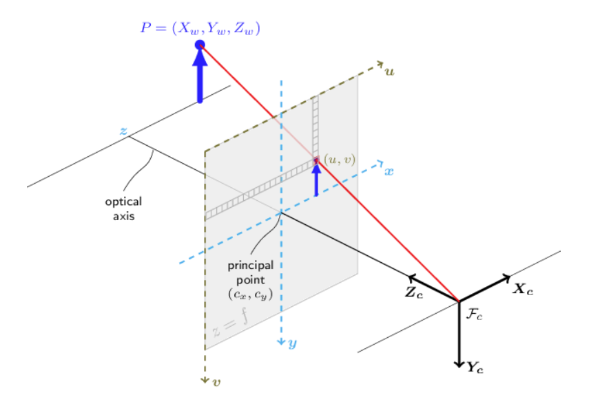

# Deep Learning for Object Detection and Segmentation

### Why Deep Learning is Needed

Partial views, cluttered scenes, infinite possible number of objects in open world, --> impractical to use only geometric methods for grasping. Need deep learning for image segmentation, predicting the geometric shape for an unseen or partially-occluded object.

### Fine Tuning (aka Transfer Learning)

Idea: COCO and ImageNet datasets have millions of high quality labeled images for object detection, semantic segmentation, instance segmentation, but for a limited number of objects/classes. If you train a model on these datasets, then use transfer-learning on much smaller (custom-made) datasets of other objects, you can make a model that is effective on many more objects.

### Labeling Data Quickly (Tools)

LabelFusion: takes RGB-D images from static scene, and CAD models for objects in the scene. LabelFusion uses dense reconstruction algorithm to merge point clouds from individual images to get complete point clouds for all objects, then can use ICP to localize all objects in scene

https://www.youtube.com/watch?v=nc65CF1W9B0

### Synthetic Data

Right now, takes high effort to make a simulated image look real, and difficult to get diverse lighting conditions and to do this for many different objects. But, it does work.

One way to make simulation data work well, even if it doesn't look very realistic, is to produce tons of variations among the things you don't care about. i.e. to train an arm to pick up a ball, keep the arm and ball realistic, but wildly vary the color or design of the background to force the model to ignore it.

 

Why Synthetic Data needs to happen: human labeling still has an error rate, which puts a cap on possible performance of a learning system. Simulated images never have any labeling error --> once the simulations look real enough, they will perform better than human-labeled real images.

## Object Detection and Segmentation Pipeline

First, some terminology:

 

The golden standard for manipulation is instance segmentation; if, for example, you take a RGB-D images from multiple angles, you can segment each using the RGB image, project the segmentations  into 3D, and classify points in the point cloud as corresponding to a certain object or not. (Afterwards, you can run ICP to calculate pose of object, or compute antipodal grasp, etc.)

Object Detection and Segmentation is difficult problem because number of outputs of network is variable. 

Solution: 

1. Use a R-CNN ("Regions wtih CNN features") network or "Region Proposal Network" to break image into ~1000 overlapping sub-images of varying sizes, based on detected edges/features. Run image recognition on each region to get percent probability of the region containing an object of each class. 

 

2. Recombine those regions to get a "mask" of regions in the original image with high probability of being the object. Then, run a bounding-box refinement model to get a tight bounding box around each object.

The output looks something like this:

 

Most performant implementation of Mask R-CNN is Facebook's Detectron2.

## Self-Supervised Learning

Generate training data without any human labeling. I.E. add a depth camera with monocular camera to produce ground truth depth data while trying to train monocular camera to do depth estimation.

### Application Example: Using Depth Camera to Create Training Data for Monocular Object Segmentation

[[Example code]](https://deepnote.com/workspace/michael-zengs-workspace-61364779-69ef-470a-9f8e-02bf2b4f369c/project/09-Object-Detection-and-Segmentation-Duplicate-45f59934-d26b-4c32-9352-1d17ab161a67/notebook/label_generation-6b4fbadc5f654817b45f6cd463f07989?)

A pinhole camera follows this equation: 

$$X_c = (u-c_x)\frac{Z_c}{f_x}$$

$$Y_c = (v-c_y)\frac{Z_c}{f_y}$$

Notations:
- $f_x$: camera intrinsic: focal length in x direction
- $f_y$: camera intrinsic: focal length in y direction
- $c_x$: camera intrinsic: principal point in x direction (pixels)
- $c_y$: camera intrinsic: principal point in y direction (pixels)
- $u$: pixel x location in 2D image
- $v$: pixel y location in 2D image
- $(X_C, Y_C, Z_C)$: points in camera frame

 

The goal will be to project 3D points from a point cloud in world frame (assume the point cloud is already cleanly segmented to only include the object of interest) to a 2D pixel mask in camera frame.

The general procedure is this:
1. Transform PC to camera frame so we have a list of $(X_C, Y_C, Z_C)$
2. Apply the equations to calculate $u$ and $v$ based on all the $(X_C, Y_C, Z_C)$
3. All the $(u, v)$ represent pixels in the 2D image in camera frame that contain the object

Now, we've used the point cloud to generate a 2D mask for the object.

## Open World

Dealing with unlimited number of unseen environments, objects. Use a Foundation Model, i.e. CLIP or Segment Anything, that learn both text and images and produce a bounding box or mask for any object given a text prompt (and perhaps other input data).

# Deep Learning for Manipulation

## Pose Estimation (for known object from RGB-D image)

Pipeline like this: Instance segmentation network (Mask R-CNN) first to get boundary box + segmented PC --> NN --> pose

### Representing Poses

Ways to represent rotation:
 - Quaternions
 - Rotation Matrices
 - NOT Euler Angles (discontinuities, etc.)

Rotation Matrices are most commonly used (9 outputs between 0, 1, where $RR^T = I$ and $det(R) = +1$. Note that you can't constrain NN to output valid rotation matrices; you just train it to do so, hope it actually outputs things that are close to rotation matrices, then post-process its output using SVD to project it onto a valid rotation matrix. The way the SVD can "project" a matrix onto a rotation matrix is like so: $A = U\Sigma V^T \rightarrow R = UV^T$. Recall that the $\Sigma$ component of SVD performs scaling and sheering, while both $U$ and $V$ are orthonormal matrices that perform rotation).

The most basic approach is to discretize the position space and then train a model to do a classification to pick a pose. But, of course, better to just do a regression model to output continuous pose.

Outputting single "Correct" pose is not enough; rotational symmetries, occlusions, mean it makes more sense to output distribution of possible poses. This is generally true for all NN in robotics; outputting a probability distribution. Bingham distribution is used bc of its natural ability to create Gaussian distribution on quaternions (need more math to understand). Alternatively, you can use a classification network on a discretized pose space and output probabilities of different classes.

### Loss Functions

Euclidean distance for translation is great.

For rotation, 3 main options:

Simple: Least-Squares Euler angle error. Simple, but not very expressive. For example, calculating the distance between 2 Euler Angles will give the lenght of a weird curved path from one angle to the other.

Medium: Quaternion-based loss functions (TODO: GIVE EXAMPLE?) that calculate geodesic distance between 2 orientations (recall that a linear interp. between 2 quaternions gives the shortest geodesic path).

Best: Loss as reconstruction error, since there sometimes can be multiple ground truth orientations for symmestric objects

## Grasp Selection

Often isn't the best strategy to estmate object's pose before calculating a grasp. Biggest limitation: requirement that object must be known in order to predict its pose.

There is research in pose estimation for categories of objects, however, this obviously has accuracy limitations depending on variation in the category:

 

Also, you often don't need object pose to do manipulation.

Instead, your NN can output: 
 - **keypoints** for categorical object manipulation (i.e., for picking up mugs, keypoint on center of bottom of mug, keypoint on center of top of mug, keypoint in center of handle). You can use the keypoint in addition to the PC to find a good antipodal grasp. Keypoint detectors are well studied in computer vision (i.e. for human pose estimation) so quite high accuracy.
 - **dense correspondences** (mapping any point on object in one view to probability heatmap of where that point is in on the object in another view (or, possibly, a different but similar object in another view). The way this works is by projecting the point in the first image to the PC, then back-projecting that point on the PC to another image from a different view. This is useful bc, i.e. if you want to pick up a mug by the handle, you can figure out where the handle is and calculate a grasp at that handle)
 - **probability of grasp success** given a grasp pose + object PC (that is calculated using geometric/antipodal methods). Typically this sort of model would be trained on real data, picking up objects, shaking the manipulator, outputting 1 or 0 for success/fail

Force control is totally also possible with many of these NN outputs. I.E. for wiping a whiteboard with a whiteboard eraser, if you predict a keypoint at the bottom of the eraser, that gives you the point at which to control the force.