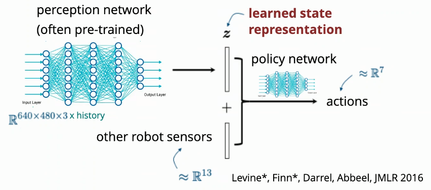

# Reinforcement Learning

***Why?***

Previous approaches discussed have a 2 part pipeline:
1) estimate the state of the world
2) decide what to do based on the state of the world

This approach is probably unideal; imagine:
 - chopping/dicing onions into hundreds of tiny pieces
 - playing with ropes
 - spreading peanut butter

These scenarios are all incredibly hard to represent in terms of a state and difficult to estimate the state of.

## The Simplest Solution: Behavior Cloning/Imitation Learning

Have a human (with VR, haptics) control the robot. Have an RNN learn from the behaviors of the human.

Limitations:
 - labor (humans have to generate the data)
 - limited by capabilities of human controllers

Behavior cloning performs very well within the convex hull of the demonstration data; i.e. it's good at interpolating actions within the action space of the demonstrations, very bad at extrapolating actions for new scenarios.

Therefore, behavior cloning also relies on a notion of stability; the robot should naturally stay within the convex hull of the demonstration data.

You can also write an optimal controller using non-RL methods, run them continously in simulation, and have the behavior cloner learn from the simulation.

### A Full Behavior Cloning Pipeline:

Feed RGB images to a large pre-trained image recognition model, remove it's final layer (that outputs an image classification), take the output of the 2nd to last layer, mix it with some other robot sensors, feed as input to a small learned network that outputs robot actions directly.

In this sense, the pre-trained instance segmentation model is doing the bulk of the work; the control problem is just sort of "fine-tuning" the instance segmentation model.

 

## Diffusion

Traditional diffusion for images: Take image dataset, add random Gaussian noise, then train model to go backwards from noisy image to clean image

This can be applied to robotics; i.e. for a given trajectory, you can learn to denoise any point in 3D space to get back onto a desired trajectory

Won't get into the technical details, but diffusion models & transformer models are performing extremely well on small amounts of demonstration data.

The general direction of the industry lies on a bet that Russ and others are making: if you do enough examples on arbitrary tasks, eventually, the robot can learn some kind of core principle of doing things in general, and the robot will be able to do new tasks as well.