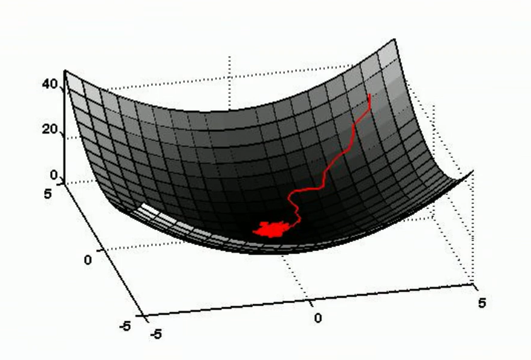
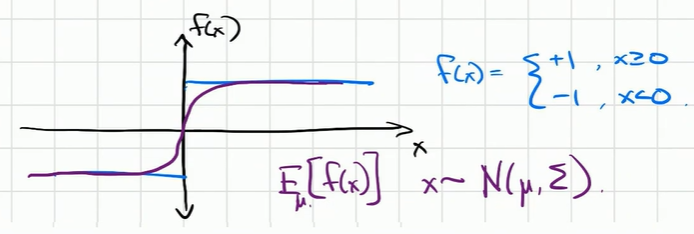
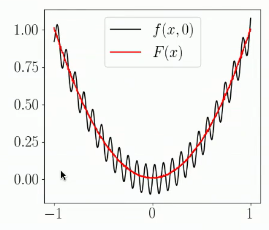
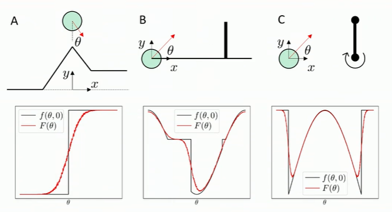

# Reinforcement Learning

***Why?***

Previous approaches discussed have a 2 part pipeline:
1) estimate the state of the world
2) decide what to do based on the state of the world

This pipeline is called *"Model-based" Control*.

This approach is probably unideal; imagine:
 - chopping/dicing onions into hundreds of tiny pieces
 - playing with ropes
 - spreading peanut butter

These scenarios are all incredibly hard to represent in terms of a state and difficult to estimate the state of.

Instead: learn *visuomotor policy*--mapping camera/sensors directly to $q$, where $q$ contains both the state of the robot (joint positions) and state of elements in the world.

## The Simplest Solution: Behavior Cloning/Imitation Learning

Have a human (with VR, haptics) control the robot. Have an RNN learn from the behaviors of the human.

THIS IS STILL A SUPERVISED LEARNING PROBLEM. Learning the parameters of a NN that maps camera inputs to iiwa commands fmom training data.

Limitations:
 - labor (humans have to generate the data)
 - limited by capabilities of human controllers

Behavior cloning performs very well within the convex hull of the demonstration data; i.e. it's good at interpolating actions within the action space of the demonstrations, very bad at extrapolating actions for new scenarios.

Therefore, behavior cloning also relies on a notion of stability; the robot should naturally stay within the convex hull of the demonstration data.

You can also write an optimal controller using non-RL methods, run them continously in simulation, and have the behavior cloner learn from the simulation.

### A Full Behavior Cloning Pipeline:

Feed RGB images to a large pre-trained image recognition model, remove it's final layer (that outputs an image classification), take the output of the 2nd to last layer, mix it with some other robot sensors, feed as input to a small learned network that outputs robot actions directly.

In this sense, the pre-trained instance segmentation model is doing the bulk of the work; the control problem is just sort of "fine-tuning" the instance segmentation model.

 

## Diffusion

Traditional diffusion for images: Take image dataset, add random Gaussian noise, then train model to go backwards from noisy image to clean image

This can be applied to robotics; i.e. for a given trajectory, you can learn to denoise any point in 3D space to get back onto a desired trajectory

Won't get into the technical details, but diffusion models & transformer models are performing extremely well on small amounts of demonstration data.

The general direction of the industry lies on a bet that Russ and others are making: if you do enough examples on arbitrary tasks, eventually, the robot can learn some kind of core principle of doing things in general, and the robot will be able to do new tasks as well.

# RL Math

The general formulation of RL is like so, to calculate the parameteres $\alpha$ for the optimal control/action policy $\Pi_{\alpha}$:

$$ u[n] = \Pi_\alpha(y[n], u[n-1], y[n-1], ~ ...) $$

where $y$ is the state, and $u$ is the outputted action.

(Scalar, one-step) Reward function:

$$ r(y[n], u[n]) $$

Therefore, the goal is:

$$ \max\limits_{\alpha} \sum_n r(y[n], u[n]) $$
$$ \text{Controller: } ~~ x[n+1] = f(x[n], u[n]) ~~~~ x[0] = x_0 $$
$$ y[n] = g(x[n], u[n]) $$
$$ \text{Policy: } ~~ u[n] = \Pi_{\alpha}(y[n], u[n-1], y[n-1], ~ ...) $$

RL is just one approach to solve this optimal control problem, emphasizes stochastic trial/error.

We re-express the optimization with randomness:

$$ \max\limits_{\alpha} E [\sum_n r(y[n], u[n])] $$
$$ \text{Controller: } ~~ P_x(x[n+1] | x[n], u[n]) $$
$$ ~~~~~~~~~~~~~~ P_y(x[n] | x[n], u[n]) $$
$$ \text{Policy: } ~~ u[n] = \Pi_{\alpha}(y[n], u[n-1], y[n-1], ~ ...) $$

where $E$ is the expected value, and $P$ are all probabilistic functions.

Below, we look at one algorithm (PPO), which uses a gradient descent method, to solve the optimal control policy and maximize reward.

## PPO (Proximal Policy Opt.)

**An Aside: Weight Perturbation**

Eval $f(\alpha)$ and $f(\alpha + w)$ where $w$ is some small disturbance.

Perform a modified "gradient descent": $\alpha = \alpha - \eta[f(\alpha + w) - f(\alpha)]w$

Intuitively, if $f(\alpha + w) > f(\alpha)$, then the perterbation $w$ is in the opposite direction as the downward gradient, then $w$ multiplied by a negative constant, so we still progress down the gradient. If, instead, $f(\alpha) > f(\alpha + w)$, then the perterbation $w$ is in the direction of the gradient, so $w$ gets multiplied by a positive constant, so we still progress down the gradient.

In technical terms, the expected value $[f(\alpha + w) - f(\alpha)]$ is proportional to the analytic gradient $\frac{\delta f}{\delta \alpha}$.

 

**Now, back to PPO**

### Policy Gradient (REINFORCE Algorithm)

The basis of REINFORCE is essentially applying weight perturbation (doing gradient descent without calculating gradients) to a probabilistic cost.

Say our goal is to minimize the cost (aka maximize reward) of our policy:

$$ \min\limits_{\alpha} E[f(x)] $$

where $x$ is selected from a probability distribution depending on parameters (to be learned) $\alpha$: $x \sim p_{\alpha}(x)$. We can optimize this using gradient descent. We'll evaluate 2 methods to compute the gradient.

#### 1. First-order Gradient Estimate
The simplest way to calculate the gradient is with simple Monte-carlo estimation (calculate the gradient at a few samples and average to estimate the expected value of the gradient): $\frac{\delta}{\delta \alpha} E[f(x)] \approx \frac{1}{K} \sum_{=1}^K \frac{\delta f(\alpha+w_i)}{\delta \alpha}$ where $w_i$ is sampled from a normal distribution.

#### 2. Zero-rder Gradient Estimate (aka REINFORCE)
*First-order Gradient Estimate* works, but there is a faster way than having to calculate where the gradient at multiple samples; we use the "log likelihood rule" (wizard math). (Now, we get into the derivation of the REINFORCE algorithm). Using log likelihood, we get that $\frac{\delta}{\delta \alpha} E[f(x)] = E[f(x) \frac{\delta}{\delta \alpha} ln (p_{\alpha}(x))]$, where, recall, $p_{\alpha}(x)$ is a Gaussian distribution (not a sample from the distribution; how this is expressed mathematically is shown below). This is called the log-likelihood method of taking the gradient of an expected value. 

<!-- From a practical standpoint, to calculate the gradient, we would evaluate $f(x) \frac{\delta}{\delta \alpha} ln (p_{\alpha}(x))$ for a number of samples (each one with a different random vlaue of $x$) and average them to estimate the expected value. -->

To understand this better, we go through an example of finding the gradient of $E[f(x)]$. Say $x \sim p_{\alpha}(x) \sim N(\alpha, \sigma^2) \sim (\alpha + N(0, \sigma^2))$ (where $N(a, b)$ is normal/Gaussian distribution around $a$ with STD $b$). Call $\beta \sim N(0, \sigma^2)$, a randomly sampled value; notice that $\beta = \alpha-x$.
1) Expanding the Gaussian (with wizard math again), we get $p_{\alpha}(x) = c*e^{\frac{-(x-\alpha)^T(x-\alpha)}{2 \sigma^2}}$ for some constant c. 
2) Taking $ln$ of $p_{\alpha}(x)$, we get: $\frac{-(x-\alpha)^T(x-\alpha)}{2 \sigma^2} + ln(c)$.
3) Taking $\frac{\delta}{\delta \alpha}$ of $ln(p_{\alpha}(x))$, we get: $\frac{(\alpha-x)^T}{\sigma^2} = \frac{1}{\sigma^2}\beta^T$.
4) Finally, $f(x) \frac{\delta}{\delta \alpha} ln (p_{\alpha}(x)) = \frac{1}{\sigma^2} f(\alpha+\beta)\beta^T$
5) The gradient update there is $\Delta \alpha = - \eta*E[\frac{1}{\sigma^2} f(\alpha+\beta)\beta^T]$

Notice: $E[\frac{1}{\sigma^2} f(\alpha+\beta)\beta^T] = \frac{1}{\sigma^2}*E[(\alpha+\beta) - f(\alpha)]\beta^T$; this is true because $f(\alpha)$ has a constant value --> $E[f(\alpha)\beta^T] = E[f(\alpha)]*E[\beta^T] = 0$ bc $E[\beta^T]=0$ (given that $\beta \sim N(0, \sigma^2)$, as we defined above.) 

**^THIS IS THE PRIMARY FINDING OF THE REINFORCE ALGORITHM; THAT $\frac{1}{\sigma^2}*E[(\alpha+w) - f(\alpha)]w$ for some $w \sim N(0, \sigma^2)$; THEREFORE, WE CAN DO GRADIENT DESCENT WITHOUT TAKING ANALYTICAL GRADIENTS.**

Now, the $f(\alpha+\beta) - f(\alpha)$ looks identical to the weight perturbation equation above. Therefore, we don't actually have to sample many values and take the expected value; we can just set the gradient update to $\Delta \alpha = - \frac{1}{\sigma^2} *(f(\alpha+\beta) - f(\alpha))\beta^T$ and get a "gradient" that is on average in the right direction. This is good because this "weight perturbation" version of the gradient is much faster to compute than the analytical gradient (which requires sampling many $\beta$ to calculate the expected value at each step).

### Which is better? First-order Gradient Estimate vs. REINFORCE

Although *First-order Gradient Estimate* is computationally more expensive, you would expect both algorithms to converge to the same answer. But actually, *First-order Gradient Estimate* can be wrong in places with zero-gradient or infinite gradient (which is particularly common around contact discontinuities). Take this as an example:

 

For somewhat large $|x|$, *First-order Gradient Estimate* may sample points all with the same cost value; therefore, the it would evaluate the expected value of the gradient to be zero, which, firstly, is wrong ($\frac{\delta}{\delta x} E[f(x)]$ is clearly not zero anywhere), and secondly, will result in gradient descent never progressing. REINFORCE, however, computes the gradient on $E[f(x)]$ directly, and so it is unbiased.

You might also expect *First-order Gradient Estimate* to have lower variance (goes more directly down the gradient), but this is also often not true (for same reasons as above).

This is another example of a loss landscape that *First-order Gradient Estimate* would really struggle on (taking a finite number of samples of the gradient may not show the big picture, resulting in getting stuck in local minima):

 

### Non-smooth Optimization

The fact that taking the expected value of a non-continuous cost function makes it continuous is the idea of *Non-smooth Optimization*. Expected value does a "randomized smoothing", ridding of the discontinuities. This is the intuition; because, for every $x$, $p_{\alpha}(x)$ may be slightly offset, there will be some cases where $x$ to the left of a continuity gets sampled as an $x$ to the right, and vice versa. Therefore, $E[f(x)]$ doesn't equal exactly $f(x)$; it gets influenced by the values of $f(x)$ on the otherside of the discontinuity, resulting in a smoothing effect of the optimization landscape. The plot of $E[f(x)]$ vs $x$ is continuous.

In theory, gradient descent always works better on $E[f(x)]$ than on $f(x)$ because gradient descent works best on smoother optimization landscapes. Especially for contact-rich scenarios (which are likely to have cost function discontinuities), you can literally pre-compute a smoother version of your cost function, use that for gradient descent, and it will be better (the intuitive explanation for contact discontinuities is that smoothing the contact discontinuities allows the model to predict/see the contact before it happens, rather than stumbling into the contact blindly and suddenly).

3 physical examples of cost functions are below (first is easiest to understand: a pass/fail criteria for whether the ball is high enough). $f(\theta, 0)$ is the original cost function; $F(\theta)$ is the expected value of the cost function with some Gaussian random noise.

 

# Appendix: Software Tools for RL

Gymnasium (formerly OpenAI Gym)

Stable Baselines 3 (collection of implementations for RL algorithms)
 - Most common for sim: PPO (Proximal Policy Opt.)
 - Surprisingly, most implementations of RL just use these implementations (harder to create one from scratch and make it better)

Most problems can be solved with RL (with lots of compute power).
 - Importance of Simulation and reward function tuning: with simulation, you can do tons of training. Also, RL often learns illogical things; you need a comprehensive reward function to encode common-sensical constraints. May also need reward-shaping for complex problems, where reward doesn't obviously map to a single action.

For sim2real, common implementations first train in an inaccurate but high-quantity (can train 10,000 robots at once on a GPU) sim to go from "nothing" to "something", then do a second round of real-life training.