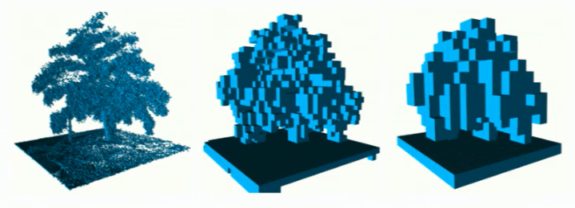
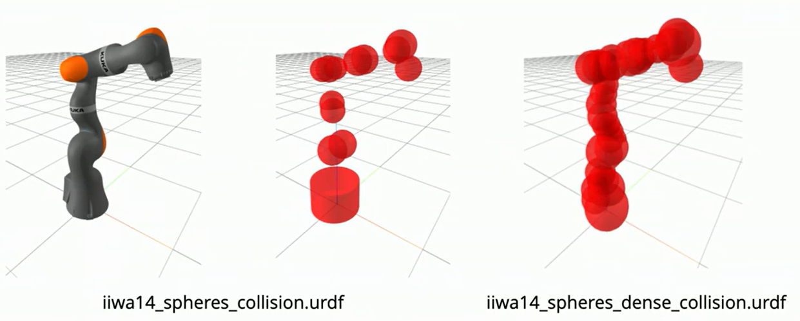

# Mobile Manipulation

### New Challenges
- Partial Views (cameras must be robot-mounted)
   - Fundamental solution: Machine Learning. There's no way to guess the shape of an unseen object without statistics/experience seeing many things
- Must consider State estimation
   - IMU, odometry, VIO, SLAM
- Motion Planning for mobile base

## Perception

Representation of Evironment (i.e. Point Cloud data).

Discretize 3D space into voxel grid. Store voxels in Octrees (data structure). What is an Octree? Each node (representing a voxel) in octree has 8 children, the voxels in all 8 directions in 3D space. Good because allow fast collision queries (i.e. check if voxel has obstacle or not). 

 

Especially fast for collision checking w/spheres (just grow outward in the tree from the center of the sphere). For this reason, many robot collision geometries are approximated by many spheres.

 

OctoMap: Open Source Github project that takes sensor data directly, builds octree maps out of them.

## Kinematics & Motion Planning

#### Holonomic Mobile Bases

Mobile base can be thought of as adding 2 more "joints"/DoF to manipulator that are unconstrainted/not limited. Just adding 2 more elements to $q$, 2 more decision variables to optimize over for IK or motion planning. Random Sampling algorithms i.e. PRM can quickly do 9 dimensions, but not much more than that.

#### Non-holonomic Mobile Bases (i.e. differential/tank drive)

IK is the same as holonomic drivebase; mapping end-effector position to joint positions and x/y coordinates of the base is simple.

The non-holonomic-ness of the drivebase leads to a velocity constraint; namely, $-\dot{x} sin \theta + \dot{y} cos \theta$ (this is equal to lateral velocity, where $\theta$ is heading of mobile base, and $x$ and $y$ are the mobile base's world coordinates) $=0$. Therefore, to do trajectory-optimization, just have to add this constraint and the solver will solve valid paths for a differential drive.

#### Constraining Rotation Angles

Doing pure optimization-based trajectory planning, you might end up with the mobile base rotating more than 180 deg. For GCS or pure optimization, you should also add constraint that $\Delta \theta \leq \pi$ or, for GCS, that the path through the convex sets don't wrap around $\pi$ in configuration space.