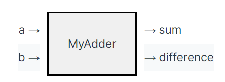
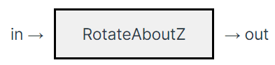

# 6.4210 Notes

# Drake
[[source]](https://deepnote.com/workspace/michael-zengs-workspace-61364779-69ef-470a-9f8e-02bf2b4f369c/project/Tutorials-Duplicate-9e3ac27c-cff2-4df4-b6f4-6c867be9f48b/notebook/dynamical_systems-28a9f57bd802463689944ad6a8e289c2)

[[Complete Manipulation Stack Example]](https://github.com/barci2/6.4210-Robotic-Manipulation)

## Building a Simulation Environment
URDF, SDF: XML formats specifying kinematic & dynamic properties of robots or objects. Generally, SDF more scalable, recommended. Allow you to define robot components lk `<link>`, `<joint>`.
 - each `<link>` contains 3 subtags:
   - `<visual>`
   - `<collision>`
   - `<inertial>`
 - for each subtag, you can define a primitive (box, sphere, cylinder) or a mesh (.obj file) to represent the geometry.

Note: Drake has a `obj` to `sdf` converter; see [["Adding your own models"]](https://deepnote.com/workspace/michael-zengs-workspace-61364779-69ef-470a-9f8e-02bf2b4f369c/project/07-Mobile-Manipulation-Duplicate-5c805ffd-a57a-462d-9967-b976b6901885/notebook/adding_models-72b973669b0c497eb201cd7a06e0c0d5#7132d9322db34d2e96ff141897e095aa)

Create scene for `HardwareStation`:
```python
if your_model_filename:
    visualizer = ModelVisualizer(meshcat=meshcat)
    visualizer.parser().AddModels(your_model_filename)
    visualizer.Run(loop_once=not running_as_notebook)

def create_scene():
    scenario_data = f"""
    directives:
    - add_model:
        name: table_top
        file: file://{table_top_sdf_file}
    - add_weld:
        parent: world
        child: table_top::table_top_center
    - add_model:
        name: sugar_box
        file: package://manipulation/hydro/004_sugar_box.sdf
        default_free_body_pose:
            base_link_sugar:
                translation: [0, 0, 0.75]
                rotation: !Rpy {{ deg: [42, 33, 18] }}    
    """
        if your_model_filename:
            your_model_file = os.path.join(os.getcwd(), your_model_filename)
            scenario_data += f"""
    - add_model:
        name: your_model
        file: file://{your_model_file}
        default_free_body_pose:
            Tennis_ball: # Change here!
                translation: [0.06, 0.1, 3]
                rotation: !Rpy {{ deg: [42, 33, 18] }}    
    """

    scenario = load_scenario(data=scenario_data)
    station = MakeHardwareStation(scenario, meshcat)

    simulator = Simulator(station)
    meshcat.StartRecording()
    simulator.AdvanceTo(5.0 if running_as_notebook else 0.1)

create_scene()
```

Boucing Objects: [[tutorial]](https://deepnote.com/workspace/michael-zengs-workspace-61364779-69ef-470a-9f8e-02bf2b4f369c/project/08-Manipulator-Control-Duplicate-73cee354-3b90-4758-a44c-77cf43419f28/notebook/bounce-373d609526a84e3c8efc451d0a52d97c?)
- Basically, add this tag under `<collision>` tag and set stiffness around `20000` and dissipation around `0.15` for both objects that will be bounced:
    ```python
    <drake:proximity_properties>
          <drake:point_contact_stiffness>
            {stiffness}
          </drake:point_contact_stiffness>
          <drake:hunt_crossley_dissipation>
            {dissipation}
          </drake:hunt_crossley_dissipation>
        </drake:proximity_properties>
    ```

YCB Objects:
```python
# These are all the YCB objects that drake comes with; to get others, you'll need to download them from the YCB website and convert them to SDFs
OBJECTS = [
    ("003_cracker_box.sdf", "base_link_cracker"),
    ("004_sugar_box.sdf", "base_link_sugar"),
    ("005_tomato_soup_can.sdf", "base_link_soup"),
    ("006_mustard_bottle.sdf", "base_link_mustard"),
    ("009_gelatin_box.sdf", "base_link_gelatin"),
    ("010_potted_meat_can.sdf", "base_link_meat"),
    ]

# obj_idx should be between 0 and len(OBJECTS)-1
obj_directives += f"""
- add_model:
    name: ycb{i}
    file: package://drake/manipulation/models/ycb/sdf/{OBJECTS[obj_idx][0]}
    default_free_body_pose:
        {OBJECTS[obj_idx][1]}:
            translation: [0, 0, 2]
            rotation: !Rpy {{ deg: [0, 0, 0] }}
        """

# add to the scenario (assuming load_scenario was already called before this).
scenario = add_directives(scenario, data=obj_directives)

# Note that once you call MakeHardwareStation with scenario, you can no longer modify the scenario or add objs or anything
station = MakeHardwareStation(scenario, meshcat)

plant = station.GetSubsystemByName("plant")

##### Simulation Setup #####
simulator = Simulator(diagram)
# simulator.set_target_realtime_rate(1.0)
simulator_context = simulator.get_mutable_context()
station_context = station.GetMyMutableContextFromRoot(simulator_context)
plant_context = plant.GetMyMutableContextFromRoot(simulator_context)
```

Freezing and unfreezing objects:
```python
obj = plant.GetModelInstanceByName(obj_name)  # ModelInstance object
joint_idx = plant.GetJointIndices(obj)[0]  # JointIndex object
joint = plant.get_joint(joint_idx)  # Joint object
joint.Lock(plant_context)

joint.Unlock(plant_context)

body_idx = plant.GetBodyIndices(model_instance)[0]  # BodyIndex object
body = plant.get_body(body_idx)  # Body object
plant.SetFreeBodyPose(plant_context, body, pose)
plant.SetFreeBodySpatialVelocity(
    context=plant_context, body=body, V_WB=spatial_velocity
)
```

Adding a visualizer

`SceneGraph` is used for visualization. Retrieve scene graph from HardwareStation: `scene_graph = station.GetSubsystemByName("scene_graph")`

## SymbolicVectorSystem
Basic input, state, output systems. Either continuous time or discreet time.

- `x` = state vector
- `u` = input vector
- `y` = output vector

For example (continuous):
$$
\dot{x} = -x + x^3
\\
y = x
$$

Translated into Drake:
```python
from pydrake.symbolic import Variable
from pydrake.systems.primitives import SymbolicVectorSystem

# Define a new symbolic Variable
x = Variable("x")

# Define the System.  
continuous_vector_system = SymbolicVectorSystem(state=[x], dynamics=[-x + x**3], output=[x])
```
<br />

## LeafSystem
While `SymbolicVectorSystem` is simple, SISO, either continuous or discreet time, deriving from `LeafSystem` directly --> all those limitations go away.

`LeafSystem` is the recommended fundamental building block of a full-stack manipulation system. You create a `LeafSystem` for every "block" of the manipulation stack; i.e. one for grasp selection, one for motion planning, etc. Each `LeafSystem` has input ports that get connected to other output ports, and output ports that get connected to other input ports, using a `Diagram` (discussed further below).

### In Depth `LeafSystem` Tutorial

[[source]](https://deepnote.com/workspace/Drake-0b3b2c53-a7ad-441b-80f8-bf8350752305/project/Tutorials-2b4fc509-aef2-417d-a40d-6071dfed9199/notebook/authoring_leaf_systems-787b2beb96614272980bf234d3a65e33?)

#### Input and Output Ports

As seen above, `LeafSytems` are implemented as Classes that extend `LeafSystem`. Several functions are needed: `__init__` must first call `LeafSystem.__init__(self)` and also must declare all input and output ports. Firstly, let's understand the two types of input and output ports: Vector-valued Ports (for vectors of primitive types) and Abstract-valued Ports (for object types). Each output port is typically assigned a function; when another System tries to access the output port of a LeafSystem, it will call this function.

Example of Vector-valued:
<center></center><br />

```python
class MyAdder(LeafSystem):
    def __init__(self):
        super().__init__()  # Don't forget to initialize the base class.
        self._a_port = self.DeclareVectorInputPort(name="a", size=2)
        self._b_port = self.DeclareVectorInputPort(name="b", size=2)
        self.DeclareVectorOutputPort(name="sum", size=2, calc=self.CalcSum)
        self.DeclareVectorOutputPort(name="difference",
                                     size=2,
                                     calc=self.CalcDifference)

    def CalcSum(self, context, output):
        # Evaluate the input ports to obtain the 2x1 vectors.
        a = self._a_port.Eval(context)
        b = self._b_port.Eval(context)

        # Write the sum into the output vector.
        output.SetFromVector(a + b)

    def CalcDifference(self, context, output):
        # Evaluate the input ports to obtain the 2x1 vectors.
        a = self._a_port.Eval(context)
        b = self._b_port.Eval(context)

        # Write the difference into output vector.
        output.SetFromVector(a - b)

# Construct an instance of this system and a context.
system = MyAdder()
context = system.CreateDefaultContext()

# Fix the input ports to some constant values.
system.GetInputPort("a").FixValue(context, [3, 4])
system.GetInputPort("b").FixValue(context, [1, 2])

# Evaluate the output ports.
print(f"sum: {system.GetOutputPort('sum').Eval(context)}")
print(f"difference: {system.GetOutputPort('difference').Eval(context)}")
```

Has 2 input ports, 2 output ports; each output port connected to a function that computes the output given current inputs. In this simple example, inputs are simply fixed (instead of i.e. being connected to the output of a differnt `System` in a bigger `Diagram`).

Example of Abstract-valued:
<center></center><br />

```python
class RotateAboutZ(LeafSystem):
    def __init__(self):
        super().__init__()  # Don't forget to initialize the base class.
        self.DeclareAbstractInputPort(name="in",
                                      model_value=Value(RigidTransform()))
        self.DeclareAbstractOutputPort(
            name="out",
            alloc=lambda: Value(RigidTransform()),
            calc=self.CalcOutput)

    def CalcOutput(self, context, output):
        # Evaluate the input port to obtain the RigidTransform.
        X_1 = system.get_input_port().Eval(context)

        X_2 = RigidTransform(RotationMatrix.MakeZRotation(np.pi / 2)) @ X_1

        # Set the output RigidTransform.
        output.set_value(X_2)

# Construct an instance of this system and a context.
system = RotateAboutZ()
context = system.CreateDefaultContext()

# Fix the input port to a constant value.
system.get_input_port().FixValue(context, RigidTransform())

# Evaluate the output port.
print(f"output: {system.get_output_port(0).Eval(context)}")
```

Single input, single output, both `RigidTransforms`.

#### State

`LeafSystems` can also have state, either vector-valued or abstract; state is only accessible to the own `LeafSystem` unless published using output port. If state variable is Vector-valued, can have `continuous` type. Otherwise, states are discreet.

Discrete states are implemented with an update function that is set to be called periodically using `DeclarePeriodicDiscreteUpdateEvent`:

```python
class SimpleDiscreteTimeSystem(LeafSystem):
    def __init__(self):
        super().__init__()
        state_index = self.DeclareDiscreteState(1)  # One state variable.
        self.DeclareStateOutputPort("y", state_index)  # One output: y=x.
        self.DeclarePeriodicDiscreteUpdateEvent(
            period_sec=1.0,  # One second time step.
            offset_sec=0.0,  # The first event is at time zero.
            update=self.Update) # Call the Update method defined below.

    # x[n+1] = x^3[n].
    def Update(self, context, discrete_state):
        x = context.get_discrete_state_vector().GetAtIndex(0)
        x_next = x**3
        discrete_state.get_mutable_vector().SetAtIndex(0, x_next)

# Instantiate the System.
system = SimpleDiscreteTimeSystem()
simulator = Simulator(system)
context = simulator.get_mutable_context()

# Set the initial conditions: x[0] = [0.9].
context.get_mutable_discrete_state_vector().SetFromVector([0.9])

# Run the simulation.
simulator.AdvanceTo(4.0)
print(context.get_discrete_state_vector())
```

For Abstract state, use a slightly different function `DeclarePeriodicUnrestrictedUpdateEvent` (the "unrestricted" refers to the fact that Abstract state doesn't need to be restricted to a discrete value?). Example:

```python
class AbstractStateSystem(LeafSystem):
    def __init__(self):
        super().__init__()
        self._traj_index = self.DeclareAbstractState(
            Value(PiecewisePolynomial()))
        self.DeclarePeriodicUnrestrictedUpdateEvent(period_sec=1.0,
                                                    offset_sec=0.0,
                                                    update=self.Update)
    def Update(self, context, state):
        t = context.get_time()
        traj = PiecewisePolynomial.FirstOrderHold(
            [t, t + 1],
            np.array([[-np.pi / 2.0 + 1., -np.pi / 2.0 - 1.], [-2., 2.]]))
        # Update the state
        state.get_mutable_abstract_state(int(self._traj_index)).set_value(traj)

system = AbstractStateSystem()
simulator = Simulator(system)
context = simulator.get_mutable_context()

# Set an initial condition for the abstract state.
context.SetAbstractState(0, PiecewisePolynomial())

# Run the simulation.
simulator.AdvanceTo(4.0)
traj = context.get_abstract_state(0).get_value()
print(f"breaks: {traj.get_segment_times()}")
print(f"traj({context.get_time()}) = {traj.value(context.get_time())}")
```


There are other events that can trigger `update` (i.e. `DeclarePerStepDiscreteUpdateEvent` - trigger an update every step in a trajectory), however most are not commonly used (see member functions of [LeafSystem](https://drake.mit.edu/doxygen_cxx/classdrake_1_1systems_1_1_leaf_system.html#a045f31a25ecb0c57baede1abd70182a8)). Also note: `DeclareStateOutputPort()` exists as a shortcut to publish state as output port; otherwise.

A `LeafSystem` can only have 1 continuous state vector, and this vector is updated using a differential equation. The differential equation is defined in a member function `DoCalcTimeDerivatives` that the leafsystem will automatically call at a high frequency. Not common, so I'll just link an example somewhere here: [[source]](https://deepnote.com/workspace/Drake-0b3b2c53-a7ad-441b-80f8-bf8350752305/project/Tutorials-2b4fc509-aef2-417d-a40d-6071dfed9199/notebook/index-04266c54423e4599a8eb2a9fdffe9bfb)

#### Publishing

`LeafSystems` also have "publish" events. They can publish whenever something external calls `LeafSystem.ForcedPublish(context)`. Or publish events can also be set to be periodic. They, however, ***cannot*** modify state variables. Main application: broadcasting data to another system i.e. ROS. Example:

```python
class MyPublishingSystem(LeafSystem):
    def __init__(self):
        super().__init__()

        # Calling `ForcePublish()` will trigger the callback.
        self.DeclareForcedPublishEvent(self.Publish)

        # Publish once every second.
        self.DeclarePeriodicPublishEvent(period_sec=1,
                                         offset_sec=0,
                                         publish=self.Publish)
        
    def Publish(self, context):
        print(f"Publish() called at time={context.get_time()}")

system = MyPublishingSystem()
simulator = Simulator(system)
simulator.AdvanceTo(3.3)

# We can also "force" a publish at a arbitrary time.
system.ForcedPublish(simulator.get_context())

"""
Example output:

Publish() called at time=0.0
Publish() called at time=1.0
Publish() called at time=2.0
Publish() called at time=3.0
Publish() called at time=3.3
"""
```

#### Appendix

Best example of LeafSystems in a full-stack manipulation system: [[source]](https://deepnote.com/workspace/michael-zengs-workspace-61364779-69ef-470a-9f8e-02bf2b4f369c/project/05-Bin-Picking-Duplicate-472e49aa-3d46-46ad-af7a-54f4c4a4294a/notebook/clutter_clearing-fcbb3e4b153244b4bcfea84da359863a?).


<br />


## Simulation

Pass diagram (returned by `DiagramBuilder.build()`) into Simulator to create a simulator. 

Optionally, pass context into simulator, or else simulator will use its own context.

Use `AdvanceTo` to move time forward.

```python
import matplotlib.pyplot as plt
from pydrake.systems.analysis import Simulator
from pydrake.systems.framework import DiagramBuilder
from pydrake.systems.primitives import LogVectorOutput

# Create a simple block diagram containing our system.
builder = DiagramBuilder()
system = builder.AddSystem(continuous_vector_system)  # Add a system to simulate
logger = LogVectorOutput(system.get_output_port(0), builder)
diagram = builder.Build()

# Set the initial conditions, x(0).
context = diagram.CreateDefaultContext()
context.SetContinuousState([0.9])

# Create the simulator, and simulate for 10 seconds.
simulator = Simulator(diagram, context)
simulator.AdvanceTo(10)

# Plot the results.
log = logger.FindLog(context)
plt.figure()
plt.plot(log.sample_times(), log.data().transpose())
plt.xlabel('t')
plt.ylabel('y(t)')
```

If using meshcat, there are also some meshcat settings that can be modified to be able to play the simiulation back after it's done (at varying speeds, etc.). This is another full example of a simulator (for an actual manipulation system):

```python
# setup meshcat
close_button_str = "Close"
meshcat = StartMeshcat()
meshcat.AddButton(close_button_str)

# Setting up the main diagram
builder = DiagramBuilder()

### Assume here that we create a scenario and a HardwareStation etc. and add it to the builder ###

# Build diagram
diagram = builder.Build()

# Setting up the simulation and contexts
simulator = Simulator(diagram)
simulator.set_target_realtime_rate(1.0)
simulator_context = simulator.get_mutable_context()

# Start simulation
meshcat.StartRecording()
simulator.AdvanceTo(0.1)
meshcat.Flush()  # Wait for the large object meshes to get to meshcat.

while not meshcat.GetButtonClicks(close_button_str):
    simulator.AdvanceTo(simulator.get_context().get_time() + 1.0)  # go on indefinitely

meshcat.DeleteButton(close_button_str)

# Publish recording so we can play it back at varying speeds for debugging
meshcat.PublishRecording()
```

### Context
[[source]](https://drake.mit.edu/troubleshooting.html#framework-context-system-mismatch)

Every `System` (i.e. `Diagram`, `HardwareStation`, `MultibodyPlant`) has a corresponding `Context`. `System` itself contains functions/operations, `Context` contains system's data.

The most high-level system in a program is typically the `Diagram`. As such, `HardwareStations`, `MultibodyPlants`, etc. will share data with the `Diagram`. Logically, we only want to create one context from scratch then, and typically we do this from the `Diagram`. Then, to get a context for the `HardwareStation` and `MultibodyPlant`, if we're using either of them, we derive it from the `Diagram`'s context:

```python
station = builder.AddSystem(MakeHardwareStation(scenario, meshcat=meshcat))
plant = station.GetSubsystemByName("plant")

builder = DiagramBuilder()
diagram = builder.Build()

simulator = Simulator(diagram)
simulator.set_target_realtime_rate(1.0)
simulator_context = simulator.get_mutable_context()
station_context = station.GetMyMutableContextFromRoot(simulator_context)
plant_context = plant.GetMyMutableContextFromRoot(simulator_context)
```

(Note that (I think) it's also possible to create the context from another System (whichever is most high level), i.e. the HardwareStation. Then, when we instantiate the Simulator, we pass it the context like so: `simulator = Simulator(diagram, station_context)`)

Now, why do we actually need a separate context for `HardwareStation` and `MultibodyPlant`? Whenever we call any plant- or station-specific functions, we may need to pass in a context, in which case we pass in the relevant context (i.e. `plant_context` for any plant functions and `station_context` for any station functions).

### Diagram & DiagramBuilder
Combine systems into more complex systems. `DiagramBuilder` class has `AddSystem()`, `Connect()` (to connect input ports to output ports). `Build()` generates new `Diagram` instance.

`HardwareStation` is itself a system that turn into a diagram; you use `DiagramBuilder.AddSystem(HardwareStation)` to create a diagram.

Example with 3 systems: plant (which is a pendulum), controller, logger.
```python
import matplotlib.pyplot as plt
import numpy as np
import pydot
from IPython.display import SVG, display
from pydrake.examples import PendulumPlant
from pydrake.systems.analysis import Simulator
from pydrake.systems.controllers import PidController
from pydrake.systems.framework import DiagramBuilder
from pydrake.systems.primitives import LogVectorOutput

builder = DiagramBuilder()

# First add the pendulum.
pendulum = builder.AddNamedSystem("pendulum", PendulumPlant())

# Add a PID controller.
controller = builder.AddNamedSystem("controller",
                                    PidController(kp=[10.], ki=[1.], kd=[1.]))

# Now "wire up" the controller to the plant.
builder.Connect(pendulum.get_state_output_port(),
                controller.get_input_port_estimated_state())
builder.Connect(controller.get_output_port_control(), pendulum.get_input_port())

# Make the desired_state input of the controller an input to the diagram.
builder.ExportInput(controller.get_input_port_desired_state())
# Make the pendulum state an output from the diagram.
builder.ExportOutput(pendulum.get_state_output_port())

# Log the state of the pendulum.
logger = LogVectorOutput(pendulum.get_state_output_port(), builder)
logger.set_name("logger")

diagram = builder.Build()
diagram.set_name("diagram")

# Visualize the diagram.
display(SVG(pydot.graph_from_dot_data(
    diagram.GetGraphvizString(max_depth=2))[0].create_svg()))
```

Example simulation of the pendulum + PID controller system:
```python
# Set up a simulator to run this diagram.
simulator = Simulator(diagram)
context = simulator.get_mutable_context()

# We'll try to regulate the pendulum to a particular angle.
desired_angle = np.pi/2.

# First we extract the subsystem context for the pendulum.
pendulum_context = diagram.GetMutableSubsystemContext(pendulum, context)
# Then we can set the pendulum state, which is (theta, thetadot).
pendulum_context.get_mutable_continuous_state_vector().SetFromVector(
    [desired_angle + 0.1, 0.2])

# The diagram has a single input port (port index 0), which is the desired_state.
diagram.get_input_port(0).FixValue(context, [desired_angle, 0.])

# Simulate for 10 seconds.
simulator.AdvanceTo(10)

# Plot the results.
log = logger.FindLog(simulator.get_context())
t = log.sample_times()
plt.figure()
# Plot theta.
plt.plot(t, log.data()[0,:],'.-')
# Draw a line for the desired angle.
plt.plot([t[0], t[-1]], [desired_angle, desired_angle], 'g' )
plt.xlabel('time (seconds)')
plt.ylabel('theta (rad)')
plt.title('PID Control of the Pendulum')
```


## Inverse Kinematics
A system that can be added to the diagram. Takes coordinates as inputs, and outputs iiwa positions. 

Use DiagramBuilder.Connect() to attach the output of the inverse kinematics to the input of the IK.

```python
controller_plant = station.GetSubsystemByName(
    "iiwa.controller"
).get_multibody_plant_for_control()
differential_ik = AddIiwaDifferentialIK(
    builder,
    controller_plant,
    frame=controller_plant.GetFrameByName("iiwa_link_7"),
)
builder.Connect(
    differential_ik.get_output_port(),
    station.GetInputPort("iiwa.position"),
)
builder.Connect(
    station.GetOutputPort("iiwa.state_estimated"),
    differential_ik.GetInputPort("robot_state"),
)
```


## Hardware Station
Simplified version of creating diagram; takes YAML and handles all the diagram and connections for you. All you need to do is create a simulator.

Has input ports and output ports. i.e. if we create a hardware station with and iiwa and a WSG hand, we get inputs iiwa.position, iiwa.feedforward_torque, wsg.position, wsg.force_limit, and output ports (i.e. iiwa.torque_measured, iiwa.position_measured, wsg.state_measured, etc.).

To access these ports, use `station.GetOutputPort("iiwa.position_measured").Eval(context)` where context is created by `context = station.CreateDefaultContext()`. Or, `station.GetInputPort("iiwa.position").FixValue(context, q_cmd)`.

Simple example that sets iiwa arm joint positions in 2D:
```python
scenario_data = """
directives:
- add_directives:
    file: package://manipulation/clutter.dmd.yaml
model_drivers:
    iiwa: !IiwaDriver
      hand_model_name: wsg
    wsg: !SchunkWsgDriver {}
"""
scenario = load_scenario(data=scenario_data)
station = MakeHardwareStation(scenario, meshcat=meshcat)

simulator = Simulator(station)

context = simulator.get_mutable_context()

simulator.set_target_realtime_rate(1.0 if interactive else 0)
meshcat.AddButton("Stop Simulation")

while meshcat.GetButtonClicks("Stop Simulation") < 1:
    simulator.AdvanceTo(simulator.get_context().get_time() + 2.0)

    # Print current joint positions
    q_current = station.GetOutputPort("iiwa.position_measured").Eval(context)
        print(f"Current joint angles: {q_current}")

    # Set new joint postions to whatever q_cmd is
    station.GetInputPort("iiwa.position").FixValue(context, q_cmd)

    # Should print values equal to q_cmd
    print(station.GetOutputPort("iiwa.position_commanded").Eval(context))

meshcat.DeleteButton("Stop Simulation")
```

## MultibodyPlant and Plants
Another alternative to HardwareStation & Diagrams.

Simulates a plant that is being controlled, specifically with multiple bodies. Takes torque input, outputs estimated state.

```python
plant = MultibodyPlant(time_step=1e-4)
Parser(plant).AddModelFromFile(".../iiwa14_no_collision.sdf")
plant.WeldFrames(plant.world_frame(), plant.GetFrameByName("iiwa_link_0"))  # Stop iiwa from falling into the ground
plant.Finalize()

# To get joint limits:
lower = plant.GetPositionLowerLimits()
upper = plant.GetPositionUpperLimits()
```


## Optimization Solver

### Symbolic Math and Differentiation

```python
import pydrake.symbolic as sym
```

Define single dimensional variables in drake like so:

```python
x_var = sym.Variable("a")
y_var = sym.Variable("b")
```

Define an [Expression](https://drake.mit.edu/pydrake/pydrake.symbolic.html#pydrake.symbolic.Expression) from a function, i.e.:

```python
def loss(theta):  # Example loss function--3 humped camel (has 3 local minima)
    """
    theta is a (2,) np array
    """
    x = theta[0]
    y = theta[1]
    eval = 2 * x**2 - 1.05 * x**4 + x**6 / 6 + x * y + y**2
    return 0.25 * eval

expression = loss(np.array([x_var, y_var]))  # Expression object
```

Symbolic Differentiation:

```python
# Gradient with respect to x and y
gradient_x = expression.Differentiate(x_var)  # pass in Symbolic Variable
gradient_y = expression.Differentiate(y_var)  # pass in Symbolic Variable

# Eval the gradients at the current x and y values
x_diff = gradient_x.Evaluate({x_var: current_x, y_var: current_y})  # Set value for each Symbolic Variable in expression
y_diff = gradient_y.Evaluate({x_var: current_x, y_var: current_y})  # Set value for each Symbolic Variable in expression
```

### About Quadratic Programming (the math)

Defined as a quadratic objective function w/Linear constraints.

Typically in the form:

$$ \min\limits_{x} \frac{1}{2} x^T A x + b^t x$$

Constraints can be in the following forms:
- Bounding Box: $LB \leq x \leq UB$
- Equality Constraint: $Cx = d$

If you plot the objective, is a paraboloid, convex, analytically solvable.


```python
prog = MathematicalProgram()
x = prog.NewContinuousVariables(2)
prog.AddConstraint(x[0] + x[1] == 1)
prog.AddCost(x[0]**2 + x[1]**2)
result = Solve(prog)

# print out the result.
print("Success? ", result.is_success())
# Print the solution to the decision variables.
print('x* = ', result.GetSolution(x))
```

Common Cost: If cost is a product of matrices, `a.dot(b)` multiplies $a^Tb$: 
```python
# These are equivalent:
prog.AddCost(x.dot(x))
prog.AddCost(x[0]**2 + x[1]**2)
```

Common Equality Constraints:
```python
prog.AddConstraint(le(x, 2*np.ones))  # all components of x must be <= 2
prog.AddConstraint(ge(x, 4*np.ones))  # all components of x must be >= 4
prog.AddConstraint(eq(x, 0.5*np.ones))  # all components of x must equal to 0.5
```

"Bounding Box" Constraint:
```python
# x (a 3x1 vector) must be >= [-0.35, -0.35, -0.35] and <= [0.35, 0.35, 0.35]
prog.AddBoundingBoxConstraint(-0.35*np.ones(3), 0.35*np.ones(3), x)
```

Important Constraints for Robot (non-collision and end-effector pose) [[source]](https://deepnote.com/workspace/michael-zengs-workspace-61364779-69ef-470a-9f8e-02bf2b4f369c/project/06-Motion-Planning-Duplicate-c2fb7d28-4b8e-4834-ba5a-a1d69c1d218b/notebook/interactive_ik-64af78e8866a4750932bdb25344edef0?)
```python
gripper_frame = plant.GetFrameByName("gripper", cylinder)  # frame name might vary depending on model
ik = InverseKinematics(plant, plant_context)
# Note: you can extract position vector from a pose (i.e. X_WG) using .rotation()
ik.AddPositionConstraint(
    gripper_frame,
    [0, 0, 0],              # gripper's position in gripper frame
    plant.world_frame(),    # frame in which two bounds below are expressed
    pose.translation(),     # lower bound on position
    pose.translation(),     # upper bound on position
)
# Note: you can extract rotation matrix from a pose (i.e. X_WG) using .rotation()
ik.AddOrientationConstraint(
    gripper_frame,          #
    RotationMatrix(),       # gripper's rotation in gripper frame (identity matrix)
    plant.world_frame(),    # frame in which required orientation of gripper is expressed
    pose.rotation(),        # required orientation of gripper expressed in frame above
    0.0,                    # allowable angle error
)
# min allowable distance between 2 objects is 1 cm. 2nd param is "influence" distance, aka the distance when it starts to create a gradient away from the collision. Should always be bigger than the 1st param.
ik.AddMinimumDistanceLowerBoundConstraint(0.01, 0.1) 

prog = ik.get_mutable_prog()
q = ik.q()
prog.AddQuadraticErrorCost(np.identity(len(q)), q0, q)
prog.SetInitialGuess(q, q0)

result = Solve(ik.prog())
if result.is_success():
    print(result.get_solution_result())
```

Note: to add constraints on position or rotation of a pose, use `RigidTransform.translation()` and `RigidTransform.rotation()`

Drake has examples of quadratic program, etc.

Examples: https://deepnote.com/workspace/Manipulation-ac8201a1-470a-4c77-afd0-2cc45bc229ff/project/03-Basic-Pick-and-Place-65aad364-ef1c-45f5-a796-fac7c122e274/notebook/09_intro_to_qp-79dfbe9d7a0e4a9e9ae7576ebdc44aaf

**Best practices for formulating optimization problems:**
- Simple cost function, add as many constraints as needed
- Complex cost functions leads to cost function parameter tuning --> a never-ending mess
- Usually costs are more intuitive as constraints; i.e. non-collision should not incur a cost, it should be a constraint
- Use minimal constraints --> larger set of feasible configurations. Only add constraints that are necessary.

Internally, Drake uses many other libraries to do the optimization, i.e. Gurobi, SNOPT, IPOPT, SCS, MOSEK.

## Robotics Programming Paradigms

1. Procedural Code (i.e. typical step-by-step script) running in separate thread/process that passes messages to a module/process that runs at high/constant frequency in the main robot thread to control hardware
2. Task Policies - typically FSMs (or "behavior trees") that get evaluated in the robot loop (decides what discrete state it is in every look)
   - enum of states
   - update function that looks at current state + sensors --> decides what state to enter next
   - if statements for each state that determine what to do
   - Pro: can be very robust if all possible states + transitions are captured
   - Con: takes intense testing + full-stack simulation to find all the edge cases/catch all the states.
   - Con: Not good for long-term/complex reasoning; good for short test goal (i.e. open a door, or put simple manipulation)
3. Task Planners chain together task-level behaviors (i.e. open dish washr door, put plate in dish washer) for long-term behavior
   - graph search
   - dynamic/online replanning
   - Using LLMs (if you give it context, current state, list of possible actions, tell it exactly how to produce the output), it will produce list of actions

## Misc.

Create transform/pose: 
```python
# Obtain the identity rotation matrix
rot = RotationMatrix.Identity()
rot2 = RotationMatrix.MakeZRotation(np.pi)  # Another potential rotation
translation_vector = np.array([1, 2, 3])
pose = RigidTransform(rotation_matrix, translation_vector)

# Inverse of a RigidTrasform: 
X_A_B = RigidTransform()  # transform of B frame relative to A frame
X_B_A = X_A_B.inverse()   # transform of A frame relative to B frame

# Apply transform to a point in A frame
p_A_mustard = np.array({1.0, 1.0, 1.0})
p_B_mustard = X_B_A @ p_A_mustard
```

Show a pose in Meshcat: 
```python
from manipulation.meshcat_utils import AddMeshcatTriad
AddMeshcatTriad(meshcat, "goal pose", X_PT=goal_pose, opacity=0.5)
```

PointCloud object in Drake:
```python
pc = DepthImageToPointCloud(normals=True, down_sample=False)

# get arrays of PC data (recommended method)
points = pc.xyzs()  # 3xN np array of points
normals = pc.normals()  # 3xN np array of normals

size = pc.size() # pts in cloud
p = pc.xyz(idx)  # idx is an int; get np array of XYZ of point at idx in PC
p_normal = pc.normal(idx)  # gets normal vector to surface at point at idx in PC
```