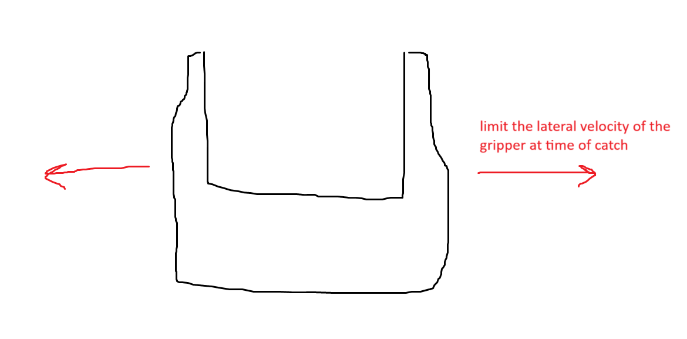

## Installations

Notes: 
- Must use Linux (or WSL in my case)
- `python` must be 3.8
- `pip` must be 20.3 or higher (`python3 -m pip install --upgrade pip`)

`source env/bin/activate`

Necessary installs:
- `sudo apt-get install xvfb`
- `pip install manipulation --upgrade --extra-index-url https://drake-packages.csail.mit.edu/whl/nightly/`
- `pip3 install ipython`
- `pip3 install pyvirtualdisplay`

## Technical Ideation

### How to Compute Optimal Grasp:

$$ \min\limits_{^WX^G} \alpha|q-q_0| - \text{contact wrenches} $$
$$ \text{subject to: joint limits} $$
$$ ^WX^G.rotation() \text{ satisfies that the object can fly in between the fingers} $$
$$ \text{contact points are not too far apart} $$

Weighted preference for positions closer to robot's resting position and for maximizing grasp's contact wrenches.

Possibly calculate some random antipodal grasps and initialize the optimization with them?

 